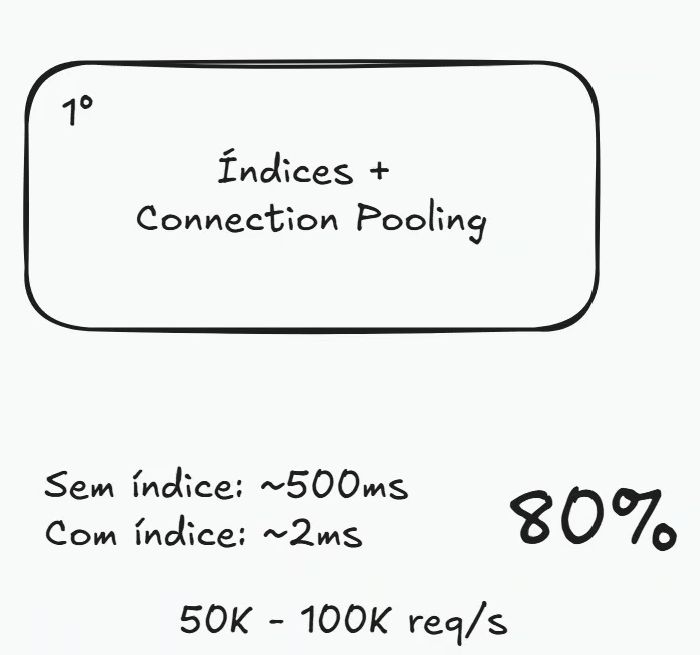
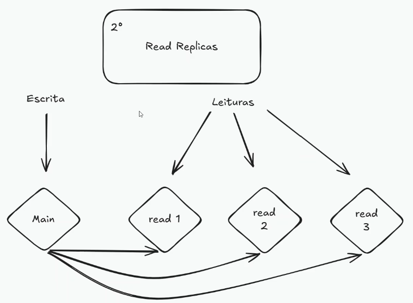

# Otimizações de Banco de Dados

A ideia desta aula é abordar as principais estratégias de otimização de banco de dados que podem aparecer em uma entrevista de **System Design**.

Quando falamos em otimizar um banco de dados, normalmente estamos tentando resolver problemas como:

* alta latência nas consultas;
* excesso de carga no banco;
* muitas conexões simultâneas;
* queries lentas;
* gargalos de leitura ou escrita;
* dificuldade de escalar o volume de dados.

É importante lembrar que toda otimização tem trade-offs. Uma estratégia pode melhorar leitura, mas piorar escrita. Pode reduzir latência, mas aumentar complexidade. Pode melhorar escala, mas dificultar consistência.

---

## 1. Cache

Uma das formas mais comuns de aliviar a carga do banco de dados é usar **cache**.

A ideia é evitar que toda requisição precise acessar diretamente o banco. Em vez disso, dados acessados com frequência podem ser armazenados temporariamente em uma camada mais rápida, como Redis ou Memcached.

Exemplo:

```txt
Usuário faz request -> 

API verifica Redis -> 

se existir no cache, retorna

-> se não existir, busca no banco e salva no cache
```

Isso é útil principalmente para dados muito lidos e pouco alterados, como:

* perfil público de usuário;
* catálogo de produtos;
* configurações;
* feed pré-computado;
* rankings;
* respostas de queries caras.

O principal benefício é reduzir a pressão no banco e diminuir a latência das respostas.

### Trade-offs de cache:

Se o cache e usado para salvar uma consulta com varios joins e a nossa tabela muda, os dados no cache podem ficar desatualizados. Pra isso existem 3 estratégias principais:

1 - Expiration: os dados no cache são removidos após um tempo definido
2 - Refresh: os dados no cache são atualizados periodicamente.
3 - Delete: os dados no cache são removidos quando a tabela muda.

Outros trade-offs:

* invalidação de cache;
* dados desatualizados;
* maior complexidade na aplicação;
* necessidade de definir TTL;
* risco de cache stampede, quando várias requisições tentam recalcular o mesmo dado ao mesmo tempo.

---

## 2. Índices

Índices são uma das otimizações mais importantes em bancos de dados. mUm índice funciona como uma estrutura auxiliar que permite encontrar dados mais rapidamente sem precisar varrer a tabela inteira. Sem índice, uma busca pode exigir um **full table scan**:

```sql
SELECT * FROM users WHERE email = 'user@email.com';
```

Se a tabela tiver milhões de usuários e não existir índice em `email`, o banco pode precisar verificar muitas linhas até encontrar o resultado.Com índice, o banco consegue localizar o dado de forma muito mais eficiente.

### Quando usar índices?

Índices fazem sentido quando uma coluna é usada com frequência em:

* filtros com `WHERE`;
* ordenações com `ORDER BY`;
* joins;
* buscas por igualdade;
* buscas por intervalo;
* colunas usadas em constraints, como `UNIQUE`.

Exemplo:

```sql
CREATE INDEX idx_users_email ON users(email);
```

Isso melhora consultas como:

```sql
SELECT * FROM users WHERE email = 'user@email.com';
```

### Trade-offs dos índices

Índices melhoram leitura, mas têm custo.

Os principais pontos negativos são:

* escritas mais lentas, porque o índice também precisa ser atualizado;
* maior uso de armazenamento;
* maior complexidade na escolha dos índices;
* índices desnecessários podem atrapalhar a performance geral.

Por isso, não faz sentido criar índice para toda coluna. O ideal é criar índices com base nos padrões reais de acesso.

---

### 2.1. Índice B-tree

O índice **B-tree** é o tipo mais comum em bancos relacionais.

Ele funciona bem para:

* buscas por igualdade;
* ordenação;
* ranges;
* comparações com `<`, `>`, `<=`, `>=`;
* filtros por datas ou números.

Exemplo:

```sql
SELECT * FROM orders
WHERE created_at BETWEEN '2022-01-01' AND '2026-01-01';
```

Para esse tipo de consulta por intervalo, um índice B-tree costuma fazer bastante sentido.

---

### 2.2. Índice Hash

Índices do tipo **hash** são úteis para buscas exatas por igualdade.

Exemplo:

```sql
SELECT * FROM users WHERE email = 'user@email.com';
```

Eles podem ser eficientes quando a consulta é sempre algo como:

```sql
coluna = valor
```

Porém, hash index não é adequado para buscas por intervalo ou ordenação.

Exemplo ruim para hash:

```sql
SELECT * FROM orders WHERE created_at > '2025-01-01';
```

Nesse caso, B-tree costuma ser mais adequado.

---

### 2.3. Índice composto

Um índice composto envolve mais de uma coluna.

Exemplo:

```sql
CREATE INDEX idx_orders_user_status ON orders(user_id, status);
```

Esse índice pode ajudar em queries como:

```sql
SELECT * FROM orders
WHERE user_id = 10 AND status = 'paid';
```

A ordem das colunas importa. Um índice em `(user_id, status)` não é necessariamente equivalente a um índice em `(status, user_id)`.

Índices compostos são muito comuns em sistemas reais, principalmente quando as queries filtram por múltiplos campos.

---

### 2.4. Outros tipos de índice

Além de B-tree, hash e composto, existem outros tipos importantes dependendo do banco e do caso de uso:

* **Full-text index**: usado para busca textual.
* **GIN**: comum no PostgreSQL para arrays, JSONB e full-text search.
* **GiST**: usado para dados geométricos, buscas aproximadas e alguns tipos específicos.
* **BRIN**: útil para tabelas muito grandes com dados naturalmente ordenados, como logs por data.

---

## 3. Connection Pooling

Abrir uma conexão com o banco de dados tem custo.

Se cada requisição da aplicação abrir uma nova conexão, executar uma query e depois fechar a conexão, o sistema pode ter um overhead muito alto.

Em cenários com muitas requisições simultâneas, isso pode causar gargalo no banco.

A ideia do **connection pooling** é manter um conjunto de conexões abertas e reutilizá-las entre várias requisições.

Fluxo sem pool:

```txt
Request -> abre conexão -> executa query -> fecha conexão
Request -> abre conexão -> executa query -> fecha conexão
Request -> abre conexão -> executa query -> fecha conexão
```

Fluxo com pool:

```txt
Request -> pega conexão do pool -> executa query -> devolve conexão ao pool
```

Isso reduz o custo de abrir e fechar conexões repetidamente.

Connection pooling é especialmente importante em aplicações web com muitas requisições concorrentes e também em ambientes serverless, onde várias instâncias podem abrir conexões ao mesmo tempo.

Exemplos de soluções relacionadas:

* PgBouncer;
* RDS Proxy;
* Prisma Accelerate;
* Supabase Pooler;
* pools nativos de ORMs e drivers.

Trade-offs:

* pool mal configurado pode esgotar conexões;
* muitas instâncias da aplicação podem criar pools demais;
* um pool muito pequeno pode virar gargalo;
* um pool muito grande pode sobrecarregar o banco.

---

É importante destacar que: Índice + Connection Pooling conseguem otimizar BDs com carga de 50k até 100k de requisições por segundo resolvendo mais de 80% do problema dos sistemas.



Além disso assim como mostra na imagem conseguem otimizar consultas de 500ms pra 2ms. 

## 4. Replicação de leitura

Em muitas aplicações, o volume de leitura é muito maior do que o volume de escrita. Exemplo: em uma rede social, uma pessoa publica um post, mas centenas ou milhares de pessoas podem ler esse mesmo post. Nesse tipo de cenário, podemos usar **read replicas**.



A ideia é ter:

* um banco principal para escrita;
* uma ou mais réplicas para leitura.

Exemplo:

```txt
Writes -> Primary DB
Reads  -> Read Replicas
```

Isso ajuda a distribuir a carga e evita que todas as leituras e escritas concorram pelo mesmo banco.

### Exemplo prático

Em uma aplicação como Twitter/X ou LinkedIn:

```txt
1 usuário cria um post.
100 usuários leem esse post.
```

Nesse caso, existe muito mais leitura do que escrita. Então faz sentido escalar leitura com réplicas.

### Trade-off: replication lag

O principal problema é o atraso de replicação.

Quando um dado é escrito no banco principal, ele pode demorar alguns segundos para aparecer nas réplicas.

Exemplo:

```txt
Usuário cria um post -> dado salvo no primary
Réplica ainda não recebeu o dado
Outro usuário pode demorar alguns segundos para ver o post
```

Para redes sociais, isso geralmente é aceitável.

Mas em sistemas bancários, financeiros ou de estoque crítico, esse atraso pode ser problemático.

Nesses casos, é comum:

* ler diretamente do banco principal após uma escrita;
* usar consistência forte em operações críticas;
* evitar réplicas para dados sensíveis;
* aceitar mais latência para garantir consistência.

---

## 5. Sharding e Partitioning

Em bancos com grande volume de dados, uma única tabela ou um único servidor pode não ser suficiente.

Nesses casos, podemos dividir os dados para melhorar:

* latência;
* tempo de consulta;
* throughput de leitura;
* throughput de escrita;
* distribuição de carga;
* capacidade de armazenamento.

Duas estratégias comuns são:

* **partitioning**;
* **sharding**.

Apesar de serem parecidas, não são exatamente a mesma coisa.

---

### 5.1. Partitioning

Partitioning é a divisão lógica dos dados dentro do próprio banco.

Em vez de manter uma tabela gigante como uma única estrutura, o banco pode dividi-la em partes menores.

Exemplo: particionar uma tabela de logs por mês.

```txt
logs_2026_01
logs_2026_02
logs_2026_03
```

Ou, em uma tabela particionada:

```txt
logs
 ├── partição janeiro
 ├── partição fevereiro
 └── partição março
```

Isso ajuda porque uma query pode acessar apenas a partição necessária.

Exemplo:

```sql
SELECT * FROM logs
WHERE created_at BETWEEN '2026-01-01' AND '2026-01-31';
```

Se a tabela for particionada por data, o banco pode consultar apenas a partição de janeiro.

Tipos comuns de partitioning:

* **por faixa/range**: exemplo, datas ou valores numéricos;
* **por hash**: distribui os dados usando uma função hash;
* **por lista/list**: separa por valores específicos, como país ou categoria.

---

### 5.2. Sharding

Sharding é a divisão dos dados entre múltiplos bancos ou servidores.

Enquanto partitioning costuma acontecer dentro do mesmo banco, sharding normalmente distribui os dados em diferentes nós.

Exemplo:

```txt
Shard 1 -> usuários de A até F
Shard 2 -> usuários de G até M
Shard 3 -> usuários de N até Z
```

Ou usando hash:

```txt
hash(user_id) % número_de_shards
```

O objetivo é distribuir carga e armazenamento horizontalmente.

### Estratégias comuns de sharding

#### Sharding por faixa

Divide os dados por intervalos.

Exemplo:

```txt
user_id 1 até 1.000.000       -> Shard 1
user_id 1.000.001 até 2.000.000 -> Shard 2
```

Vantagem:

* simples de entender;
* bom para queries por intervalo.

Desvantagem:

* pode gerar hot spots se muitos acessos ficarem concentrados em uma faixa.

---

#### Sharding por hash

Usa uma função hash para distribuir os dados.

Exemplo:

```txt
hash(user_id) % 4
```

Vantagem:

* distribui melhor os dados;
* reduz chance de hot spots.

Desvantagem:

* queries por intervalo ficam mais difíceis;
* adicionar novos shards pode exigir rebalanceamento.

---

#### Sharding por chave ou tenant

Divide os dados com base em uma chave de negócio.

Exemplo:

```txt
empresa A -> Shard 1
empresa B -> Shard 2
empresa C -> Shard 3
```

Isso é comum em sistemas multi-tenant.

Vantagem:

* isolamento por cliente/tenant;
* pode facilitar escala por organização.

Desvantagem:

* tenants muito grandes podem concentrar carga em um único shard.

---

### Trade-offs de sharding

Sharding melhora escala, mas aumenta bastante a complexidade.

Problemas comuns:

* queries entre shards são mais difíceis;
* transações distribuídas ficam complexas;
* joins entre shards são ruins;
* rebalanceamento pode ser difícil;
* a aplicação precisa saber onde buscar os dados;
* consistência pode ser mais difícil de garantir.

Em entrevista de System Design, sharding costuma ser uma solução para escala alta, mas não deve ser a primeira opção. Normalmente, antes de sharding, pensamos em:

1. bons índices;
2. otimização de queries;
3. cache;
4. read replicas;
5. partitioning;
6. sharding.

---

## 6. Teorema CAP

O Teorema CAP é um conceito importante em sistemas distribuídos.

Ele afirma que, em um sistema distribuído, diante de uma falha de partição de rede, não é possível garantir simultaneamente:

* **Consistency**;
* **Availability**;
* **Partition Tolerance**.

### Consistency

Todos os nós enxergam o mesmo dado ao mesmo tempo.

Exemplo:

```txt
Se uma transferência bancária foi confirmada, qualquer leitura posterior deve refletir esse novo saldo.
```

### Availability

O sistema continua respondendo, mesmo que algumas partes estejam com problema.

Exemplo:

```txt
Mesmo se um nó falhar, a aplicação ainda responde às requisições.
```

### Partition Tolerance

O sistema continua funcionando mesmo quando existe falha de comunicação entre nós.

Exemplo:

```txt
Dois servidores não conseguem se comunicar temporariamente, mas o sistema precisa lidar com isso.
```

### Interpretação prática

Em sistemas distribuídos, falhas de rede podem acontecer. Por isso, normalmente assumimos que **Partition Tolerance** é necessária.

Quando ocorre uma partição, o sistema precisa escolher entre:

* priorizar consistência;
* priorizar disponibilidade.

Exemplo com prioridade em consistência:

```txt
Se não for possível garantir o dado correto, o sistema pode recusar a operação.
```

Exemplo com prioridade em disponibilidade:

```txt
O sistema continua respondendo, mesmo que alguns dados possam estar temporariamente desatualizados.
```

Em uma entrevista, o ponto principal é explicar o trade-off.

Exemplos:

* sistema bancário tende a priorizar consistência;
* feed de rede social pode aceitar consistência eventual;
* carrinho de compras pode aceitar alguma inconsistência temporária;
* estoque e pagamento geralmente exigem mais consistência.

---

## 7. Normalização e Denormalização

A modelagem dos dados também afeta performance.

Duas estratégias importantes são:

* normalização;
* denormalização.

---

### 7.1. Normalização

Normalização é o processo de dividir os dados em tabelas menores e relacionadas para reduzir redundância e evitar inconsistências.

Exemplo ruim:

```txt
Tabela users:
- id
- name
- email
- bank_account_number
- bank_name
- bank_branch
```

Podemos separar em:

```txt
Tabela users:
- id
- name
- email

Tabela bank_accounts:
- id
- user_id
- account_number
- bank_name
- bank_branch
```

Vantagens:

* reduz duplicação;
* melhora integridade;
* facilita atualização de dados;
* evita inconsistência.

Desvantagens:

* pode exigir joins;
* algumas leituras ficam mais caras;
* queries podem ficar mais complexas.

Normalização costuma ser uma boa escolha quando consistência e integridade dos dados são mais importantes.

---

### 7.2. Denormalização

Denormalização é duplicar dados de propósito para melhorar a performance de leitura.

Exemplo:

```txt
Tabela orders:
- id
- user_id
- user_name
- user_email
- total
```

Mesmo que `user_name` e `user_email` já existam na tabela de usuários, eles podem ser duplicados em `orders` para evitar joins frequentes.

Vantagens:

* leituras mais rápidas;
* menos joins;
* queries mais simples;
* útil para dados muito acessados.

Desvantagens:

* maior uso de armazenamento;
* risco de inconsistência;
* atualizações ficam mais difíceis;
* pode exigir eventos ou jobs para manter dados sincronizados.

Denormalização é comum em sistemas de alta escala, principalmente quando a aplicação tem padrões de leitura muito previsíveis.

Exemplos:

* feed de rede social;
* catálogo de produtos;
* dashboards;
* relatórios;
* sistemas com muitos reads e poucos writes.

---

## 8. Otimização de Queries

Além da estrutura do banco, também é importante otimizar as queries.

Uma query mal escrita pode continuar lenta mesmo com bons índices.

Algumas estratégias importantes:

---

### 8.1. Usar EXPLAIN / EXPLAIN ANALYZE

`EXPLAIN` mostra como o banco pretende executar a query.

`EXPLAIN ANALYZE` executa a query e mostra o plano real, incluindo tempo gasto em cada etapa.

Isso ajuda a identificar problemas como:

* full table scan;
* índice não utilizado;
* join caro;
* ordenação pesada;
* leitura de muitas linhas desnecessárias.

Exemplo:

```sql
EXPLAIN ANALYZE
SELECT * FROM orders
WHERE user_id = 10
ORDER BY created_at DESC;
```

---

### 8.2. Filtrar cedo

Sempre que possível, é melhor reduzir o volume de dados antes de fazer joins ou agregações.

Exemplo ruim:

```sql
SELECT *
FROM orders o
JOIN users u ON u.id = o.user_id
WHERE o.created_at >= '2026-01-01';
```

Dependendo do banco e do plano de execução, pode ser melhor garantir que o filtro reduza os dados o quanto antes.

Exemplo conceitual:

```sql
SELECT *
FROM (
  SELECT * FROM orders
  WHERE created_at >= '2026-01-01'
) o
JOIN users u ON u.id = o.user_id;
```

Na prática, otimizadores modernos muitas vezes já fazem isso, mas em entrevistas é válido mencionar a ideia: reduzir o volume de dados o mais cedo possível.

---

### 8.3. Evitar nested subqueries desnecessárias

Subqueries aninhadas podem deixar a query mais difícil de otimizar e entender.

Nem toda subquery é ruim, mas subqueries desnecessárias podem piorar performance.

Às vezes, uma query pode ser reescrita usando:

* joins;
* CTEs;
* índices melhores;
* materialized views;
* tabelas auxiliares.

---

### 8.4. Paginação

Retornar muitos dados de uma vez é um problema comum.

Exemplo ruim:

```sql
SELECT * FROM orders;
```

Em uma tabela grande, isso pode gerar:

* alto consumo de memória;
* resposta lenta;
* sobrecarga na rede;
* pior experiência para o usuário.

O ideal é paginar.

Exemplo com `LIMIT` e `OFFSET`:

```sql
SELECT * FROM orders
ORDER BY created_at DESC
LIMIT 20 OFFSET 100;
```

Porém, em tabelas muito grandes, paginação com `OFFSET` pode ficar lenta.

Uma alternativa é usar **cursor-based pagination**.

Exemplo:

```sql
SELECT * FROM orders
WHERE created_at < '2026-06-01T10:00:00'
ORDER BY created_at DESC
LIMIT 20;
```

Cursor pagination costuma escalar melhor para feeds, timelines e listas grandes.

---

### 8.5. Batching

Batching consiste em agrupar várias operações em uma única chamada ou transação.

Exemplo ruim:

```txt
Inserir 1 registro por request.
Inserir 1 registro por request.
Inserir 1 registro por request.
```

Exemplo melhor:

```txt
Inserir 100 registros em uma única operação.
```

Isso reduz overhead de rede, transações e conexões.

Batching é útil para:

* inserção em massa;
* processamento assíncrono;
* importação de dados;
* atualização de muitos registros;
* sistemas com eventos.

---

### 8.6. Materialized Views

Uma materialized view armazena o resultado de uma query previamente calculada.

Isso é útil para queries caras que não precisam ser recalculadas a todo momento.

Exemplo:

```txt
Relatório mensal de vendas.
Dashboard com métricas agregadas.
Ranking diário.
```

Se os dados não mudam com frequência, faz sentido pré-computar o resultado.

Exemplo:

```sql
CREATE MATERIALIZED VIEW monthly_sales AS
SELECT
  date_trunc('month', created_at) AS month,
  SUM(total) AS total_sales
FROM orders
GROUP BY month;
```

Vantagens:

* leitura muito mais rápida;
* bom para dashboards e relatórios;
* reduz queries pesadas em tempo real.

Desvantagens:

* dados podem ficar desatualizados;
* precisa definir estratégia de refresh;
* ocupa armazenamento extra.

---

## Resumo

As principais estratégias de otimização de banco de dados são:

* usar cache para reduzir carga no banco;
* criar índices com base nos padrões de acesso;
* usar connection pooling para reaproveitar conexões;
* usar read replicas quando há muito mais leitura do que escrita;
* usar partitioning para dividir tabelas muito grandes;
* usar sharding para escalar horizontalmente;
* entender os trade-offs do Teorema CAP;
* normalizar para consistência;
* denormalizar para leitura rápida;
* otimizar queries com EXPLAIN, paginação, batching e materialized views.

Em entrevistas de System Design, o mais importante não é apenas citar a técnica, mas explicar:

```txt
Qual problema ela resolve?
Qual trade-off ela cria?
Em qual cenário ela faz sentido?
```
