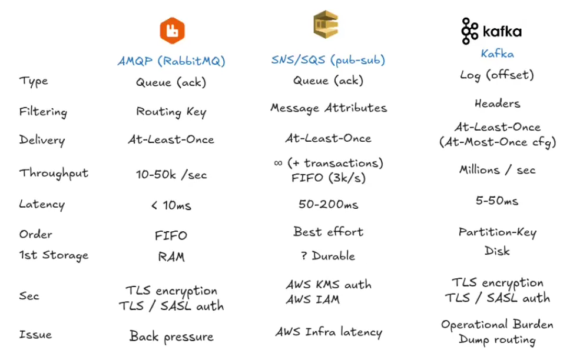

# RabbitMQ x Kafka x SQS/SNS

Para conseguir definir qual é a melhor escolha para o projeto usado, precisamos entender algumas coisas, vamos começar entendendo como cada uma funciona.

---

## RabbitMQ

No RabbitMQ, o produtor publica uma mensagem em um *exchange*, que a roteia para uma ou mais filas. Os consumidores recebem mensagens das filas e confirmam o processamento com um *acknowledgement*.

```text
Publisher → Exchange → Queue → Consumer
```

---

## SQS e SNS

O SQS é uma fila gerenciada: os consumidores fazem *polling* para receber mensagens e confirmam sua remoção após o processamento. O SNS é um serviço pub/sub que envia cópias de uma publicação para assinantes, como filas SQS, funções Lambda ou endpoints HTTP. A principal vantagem é a integração direta com outros serviços da AWS:

```text
SNS → SQS → Lambda → Amazon Aurora
```

---

## Kafka

O Kafka mantém registros em um log particionado. O consumidor lê os registros a partir de um offset, e o *consumer group* coordena quais consumidores processam cada partição. Como os registros permanecem retidos por um período configurável, é possível relê-los.

---

RabbitMQ e SQS são orientados a filas de trabalho: depois da confirmação, a mensagem deixa de estar disponível naquele fluxo. Kafka é orientado a log: consumir um registro não o apaga, e a posição de leitura permite fazer replay dentro da janela de retenção. FIFO não é sinônimo de pilha; uma fila segue a ordem de entrada, enquanto uma pilha remove primeiro o último item inserido.

As diferenças principais estão em throughput, latência, ordenação, retenção, operação e segurança. A imagem abaixo resume a comparação:



Os números de throughput variam muito conforme configuração, tamanho das mensagens, persistência, quantidade de partições e infraestrutura. RabbitMQ pode oferecer baixa latência e também suporta mensagens duráveis; persistência e confirmações, porém, reduzem o throughput.

O SQS Standard escala de forma gerenciada e oferece ordenação por melhor esforço. O SQS FIFO oferece ordenação e deduplicação dentro de seus limites de uso. Limites e preços mudam conforme região, modo e configuração, então devem ser confirmados na documentação ao dimensionar a solução.

Kafka pode alcançar throughput muito alto usando partições, escrita sequencial e batching. Em troca, exige planejar retenção, replicação, particionamento e operação do cluster.

---

## Vantagens e desvantagens

Começando pelo RabbitMQ: se muitas mensagens forem publicadas e não forem consumidas, o acúmulo aumenta o uso de memória e disco e pode reduzir o desempenho. Sua principal vantagem é atender bem a filas de tarefas e roteamento de mensagens com baixa latência, além de ser mais simples de operar do que um cluster Kafka em muitos cenários.

No SQS, a latência e o custo por operação precisam entrar no dimensionamento. A maior vantagem é o baixo esforço operacional e a forte integração com outros serviços da AWS.

No Kafka, a principal desvantagem é a complexidade do cluster, do ajuste de desempenho e do particionamento. Serviços gerenciados reduzem parte desse trabalho, mas não eliminam as decisões operacionais. Ele é vantajoso quando são necessários throughput alto, retenção de eventos e replay por múltiplos consumidores.

## Segurança

RabbitMQ e Kafka podem usar TLS para criptografia em trânsito e mecanismos próprios de autenticação e autorização, como SASL no Kafka. SQS integra controle de acesso com AWS IAM e criptografia em repouso com AWS KMS.

---

## Qual é melhor?

Depois de analisar todos esses dados você pode estar se perguntando, qual é o melhor? E a resposta é: DEPENDE.

Assim como qualquer coisa na engenharia de software precisamos saber que tudo vai depender do contexto, onde se eu fosse analisar começaria por: 

- qual throughput eu preciso? 
- qual a latência que é necessária? 
- preciso de ordenação?
- por quanto tempo preciso armazenar as mensagens?
- quais requisitos de segurança preciso atender?
- preciso filtrar minhas mensagens? 
- preciso reenviar minhas mensagens?
- estou usando AWS?

E com base nessas respostas conseguimos ter a visão de qual ferramenta de fila seria melhor para o contexto do nosso app.
