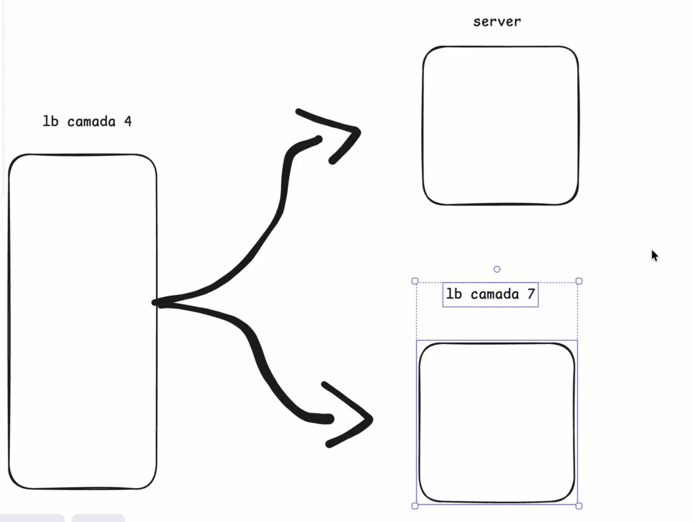

# Load Balancer

O propósito do Load Balancer é distribuir o tráfego de entrada entre vários servidores ou instâncias de um serviço. Então, quando um usuário acessa uma aplicação, o Load Balancer decide para qual instância aquela requisição será enviada.

## Para que serve o Load Balancer?

1. Distribuir carga - Distribuir o tráfego de entrada entre vários servidores ou instâncias de um serviço.
2. Escalabilidade - Permitir que a aplicação cresça horizontalmente, adicionando ou removendo instâncias conforme a demanda.
3. Alta disponibilidade - Se uma instância falhar, o tráfego pode ser redirecionado para outras que continuam saudáveis.
4. Segurança - Em alguns cenários, ele também ajuda em camadas de proteção, como TLS termination, WAF e mitigação de ataques volumétricos.

Em aplicações reais, é comum existir mais de um Load Balancer. Podemos ter um entre cliente e front-end, outro entre front-end e back-end e, em algumas arquiteturas, mecanismos de balanceamento também na camada de banco para distribuir leitura entre réplicas. Ou seja, o balanceamento pode aparecer em vários níveis da aplicação.

---

## Funcionalidades do Load Balancer

1. Health check - Verificar a saúde das instâncias. Se uma instância cair ou começar a responder mal, o Load Balancer para de enviar tráfego para ela.
2. Distribuição de carga - Direcionar mais tráfego para instâncias menos ocupadas, dependendo do algoritmo configurado.
3. TLS termination - Encerrar o TLS no próprio balanceador, centralizando certificados e simplificando a camada de aplicação.
4. Regras de roteamento - Em balanceadores de camada 7, é possível rotear por host, caminho, header ou outras características da requisição.
5. Segurança - Integrar autenticação, rate limiting, WAF ou outras proteções, dependendo da solução adotada.

---

## Como o Load Balancer distribui a carga?

Agora que entendemos as funcionalidades do Load Balancer, vamos entender como ele funciona distribuindo a carga:

1. Round Robin - O Load Balancer distribui a carga entre os servidores ou instâncias de um serviço usando o algoritmo Round Robin, onde cada solicitação é atribuída ao próximo servidor na fila.
2. Weighted Round Robin - O Load Balancer pode usar o algoritmo Weighted Round Robin, onde cada servidor recebe um peso e o tráfego é distribuído com base nesses pesos. Isso é útil quando as instâncias têm capacidades diferentes.
3. Least Connections - O Load Balancer pode usar o algoritmo Least Connections, onde o servidor ou instância de um serviço com menos conexões ativas recebe mais tráfego.
4. Least Response Time - O Load Balancer pode usar o algoritmo Least Response Time, onde o servidor ou instância de um serviço com menor tempo de resposta recebe mais tráfego.
5. IP Hash - O Load Balancer pode usar o algoritmo IP Hash, onde o servidor é escolhido com base no endereço IP do cliente. Isso ajuda a manter afinidade, direcionando o mesmo cliente para a mesma instância em muitos casos.

## Estático vs. dinâmico

O Load Balancer pode ser configurado como estático ou dinâmico, dependendo da necessidade. 

Um Load Balancer estático tem:
1. Regras fixas - O conjunto de destinos é previamente definido e muda pouco ou nada em tempo de execução.
2. Pouca ou nenhuma adaptação ao estado atual - Ele tende a decidir com base em regras fixas, sem reagir bem à saúde ou à carga das instâncias.

Um Load Balancer dinâmico tem:
1. Monitoramento dos servidores - Ele acompanha a saúde e, em alguns casos, a carga das instâncias.
2. Ajuste em tempo real - Direciona o tráfego para os destinos mais adequados com base no estado atual do sistema.

## Stateful vs. stateless

Um Load Balancer stateful mantém algum contexto da sessão do cliente, como afinidade de sessão (`sticky session`). Já um Load Balancer stateless trata cada requisição de forma independente, sem guardar esse contexto.

Na prática, arquiteturas stateless costumam escalar melhor, porque qualquer instância consegue atender qualquer requisição. Quando a aplicação depende de sessão local, o balanceador pode precisar manter afinidade entre cliente e servidor.

---

## Camada OSI

O Load Balancer normalmente opera na camada 4 ou na camada 7 do modelo OSI.

- Camada 4: toma decisões com base em IP, porta, TCP e UDP
- Camada 7: toma decisões com base em informações da aplicação, como URL, host, header e protocolo HTTP/HTTPS

A imagem destaca exatamente essa diferença: na camada 7 o balanceador enxerga detalhes do protocolo de aplicação; na camada 4 ele trabalha em um nível mais baixo, olhando principalmente para endereço e transporte.

---

## Diferença entre os tipos de Load Balancer

### Camada 4 (camada de transporte)

O Load Balancer de camada 4 trabalha no nível de transporte. Ele não entende a regra de negócio nem o conteúdo da requisição HTTP. A decisão normalmente é baseada em informações como:

- IP de origem
- IP de destino
- Porta de origem
- Porta de destino
- Protocolo TCP ou UDP

Como ele não precisa interpretar a aplicação, tende a ser mais simples e rápido.

Vantagens:
- Alto desempenho
- Baixa latência
- Baixo overhead
- Funciona bem com protocolos que não são HTTP

Desvantagens:
- Não consegue rotear por URL, header, método HTTP ou payload
- Tem menos flexibilidade para regras específicas da aplicação
- Geralmente oferece menos recursos de aplicação, como autenticação, cache e rate limiting

Casos de uso:
- Conexões com bancos de dados
- Serviços TCP ou UDP
- Jogos online
- Sistemas que precisam de alta performance e baixa latência

### Camada 7 (camada de aplicação)

O Load Balancer de camada 7 trabalha no nível da aplicação. Ele entende detalhes do protocolo usado pela aplicação, principalmente HTTP/HTTPS e, em muitos cenários, gRPC.

Ele pode tomar decisões com base em:

- Hostname
- Caminho da URL
- Headers
- Cookies
- Método HTTP, como GET, POST, PUT e DELETE
- Informações do protocolo de aplicação

Por enxergar a requisição com mais detalhe, ele permite regras de roteamento mais inteligentes.

Vantagens:
- Roteamento por domínio, rota, header ou método HTTP
- Melhor suporte para microsserviços
- Possibilidade de centralizar autenticação, cache, rate limiting, WAF e TLS termination
- Mais controle sobre tráfego HTTP e APIs

Desvantagens:
- Maior complexidade operacional
- Maior consumo de CPU e memória
- Pode adicionar mais latência do que um balanceador de camada 4
- Normalmente custa mais, dependendo da solução usada

---

Um ponto importante é que usar um Load Balancer de camada 4 não exclui o uso de um Load Balancer de camada 7. Muitas arquiteturas usam os dois.

Por exemplo, um balanceador de camada 4 pode distribuir conexões TCP entre regiões ou clusters, enquanto um balanceador de camada 7, dentro de cada região, roteia requisições HTTP para serviços diferentes com base no domínio ou no caminho da URL.

Em aplicações web e APIs, o Load Balancer de camada 7 costuma aparecer com mais frequência, porque ele oferece mais controle sobre o tráfego da aplicação. Já em cenários de baixa latência, tráfego TCP/UDP genérico ou protocolos que não são HTTP, a camada 4 pode fazer mais sentido.

---

## Casos de uso

Normalmente, o Load Balancer é usado em algum serviço de cloud, como AWS, Azure ou GCP. Também é possível usar um Load Balancer fora da cloud, em servidores próprios, mas em cenários reais de escala é mais comum usar soluções gerenciadas ou ferramentas dedicadas, como NGINX, HAProxy, Envoy e Traefik.

Em aplicações grandes, é comum existir balanceamento em mais de um nível. Pode haver um balanceador global distribuindo tráfego entre regiões com base em latência, saúde e proximidade geográfica, e outros balanceadores internos distribuindo tráfego entre serviços e instâncias dentro de cada região.

## Trade-offs

- Escalabilidade
- Confiabilidade
- Lidar com falhas
- Reduzir latência
- Aumentar a flexibilidade de roteamento

Desvantagens:
- Maior custo
- Maior complexidade
- Pode adicionar latência, porque a requisição passa pelo Load Balancer antes de chegar ao servidor. Em sistemas com apenas uma instância, essa camada extra pode não compensar. Em sistemas com várias instâncias, regiões ou serviços, o ganho de disponibilidade, distribuição de carga e resiliência normalmente compensa esse custo.
