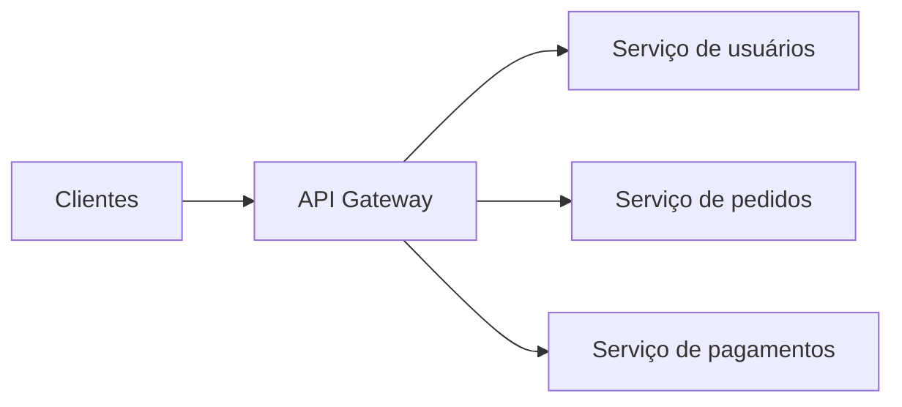

# API Gateway

O API Gateway é a porta de entrada das requisições para o back-end. Em vez de o cliente conversar diretamente com vários serviços internos, ele envia a requisição para um ponto central, e esse componente decide como tratá-la e para onde encaminhá-la.

Em system design, o API Gateway é comum em arquiteturas com múltiplos serviços, porque ele ajuda a esconder a complexidade interna do sistema. Para o cliente, a API parece unificada; para o sistema, o gateway pode aplicar regras de segurança, roteamento e controle antes de a requisição chegar ao serviço de destino.

## Para que serve o API Gateway?

As principais responsabilidades de um API Gateway são:

1. Roteamento - Direcionar cada requisição para o serviço correto.
2. Autenticação e autorização - Validar token, sessão, API key ou permissões antes de liberar o acesso.
3. Rate limiting - Limitar o volume de requisições por usuário, cliente, IP ou chave de API.
4. Validação de requisição - Verificar headers, parâmetros, payload e schema antes de enviar para o back-end.
5. Transformação de protocolo ou payload - Adaptar entradas e saídas, por exemplo recebendo HTTP/JSON e chamando um serviço interno via gRPC.
6. Observabilidade - Centralizar logs, métricas, tracing e auditoria.
7. Agregação de respostas - Em alguns casos, combinar dados de mais de um serviço e retornar uma resposta única para o cliente.
8. Cache - Evitar chamadas repetidas para dados que mudam pouco.

Na prática, ele reduz o acoplamento entre cliente e serviços internos. O front-end não precisa conhecer a topologia completa do sistema, nem lidar diretamente com várias URLs, protocolos ou regras de segurança diferentes.

---

## Como o API Gateway funciona?

O fluxo normalmente é este:

1. O cliente envia a requisição para o API Gateway.
2. O gateway valida a requisição, autentica o cliente e aplica regras como rate limit.
3. O gateway decide para qual serviço interno a chamada será enviada.
4. Se necessário, ele transforma a requisição ou enriquece headers com contexto.
5. O serviço interno processa a chamada e devolve a resposta.
6. O gateway pode transformar a resposta antes de enviá-la ao cliente.

Isso cria uma camada central de controle na borda da aplicação.

---

## Benefícios

### 1. Simplificação para o cliente

Sem API Gateway, um cliente pode precisar chamar vários serviços diferentes e conhecer detalhes de cada um. Com o gateway, ele conversa com uma interface mais consistente.

### 2. Centralização de responsabilidades transversais

Autenticação, rate limit, logging, tracing, CORS e validação podem ser tratados em um único lugar, em vez de serem reimplementados em todos os serviços.

### 3. Proteção do back-end

O gateway bloqueia parte das requisições inválidas ou abusivas antes que elas consumam recursos dos serviços internos. Isso reduz carga desnecessária e ajuda na proteção contra abuso e picos de tráfego.

### 4. Evolução mais segura da arquitetura

Os serviços internos podem mudar de endereço, tecnologia ou protocolo sem necessariamente quebrar os clientes, desde que o contrato exposto pelo gateway continue estável.

---

## Funcionalidades comuns

### Roteamento

O gateway pode rotear por:

- caminho da URL
- domínio
- método HTTP
- header
- versão da API

Exemplo:

- `/users` vai para o serviço de usuários
- `/payments` vai para o serviço de pagamentos
- `/orders` vai para o serviço de pedidos

### Autenticação e autorização

É comum o API Gateway validar JWT, OAuth, sessão ou API key antes de encaminhar a requisição. Em muitos casos, ele também propaga para os serviços internos informações como:

- id do usuário
- roles
- tenant
- permissões

Isso evita repetir a mesma lógica básica em todos os serviços, embora validações críticas de negócio ainda possam ser reforçadas internamente.

### Rate limiting

O rate limit controla quantas requisições um cliente pode fazer em um intervalo de tempo.

Ele pode ser aplicado por:

- IP
- usuário
- token
- API key
- rota
- tipo de plano

Exemplos:

- 100 requisições por minuto por usuário
- 1000 requisições por minuto por API key
- limite diferente para rotas pesadas e rotas leves

Isso protege a aplicação contra abuso, bots, picos inesperados e uso desproporcional de recursos.

### Validação

O gateway pode rejeitar cedo requisições malformadas, com campos obrigatórios ausentes, tipos inválidos ou headers incorretos. Isso reduz tráfego inútil para o back-end, mas não substitui totalmente validações internas, porque o serviço ainda precisa se proteger.

### Transformação e adaptação

Um gateway pode:

- receber REST e chamar serviços internos via gRPC
- renomear campos
- adaptar versões de payload
- agregar respostas de mais de um serviço

Isso é útil quando os clientes precisam de uma API mais estável do que a organização interna dos serviços.

### Observabilidade

Como todo tráfego passa por esse ponto, o API Gateway é um bom local para coletar:

- logs de acesso
- métricas de latência
- taxa de erro
- volume de tráfego
- tracing distribuído

Isso ajuda bastante na operação e no diagnóstico de problemas.

---

## API Gateway vs. Load Balancer

Os dois componentes podem parecer parecidos, mas não têm o mesmo papel.

O Load Balancer distribui tráfego entre várias instâncias de um mesmo serviço ou grupo de serviços. Já o API Gateway atua mais próximo da camada de aplicação, entendendo regras de API, autenticação, contratos e roteamento por contexto de negócio.

De forma simplificada:

- Load Balancer: foco em distribuir carga e aumentar disponibilidade
- API Gateway: foco em controlar, proteger e organizar o acesso à API

Em muitas arquiteturas, os dois coexistem. Por exemplo:

1. O cliente chama o API Gateway.
2. O gateway encaminha a requisição para um serviço.
3. Um Load Balancer distribui essa requisição entre as instâncias daquele serviço.

---

## BFF e API Gateway

Em alguns sistemas, existe também o padrão BFF (Backend for Frontend). Nesse caso, em vez de um gateway genérico servir igualmente todos os clientes, pode existir uma camada específica para web, mobile ou parceiros externos.

Isso faz sentido quando cada tipo de cliente precisa de contratos, agregações ou otimizações diferentes.

Nem todo BFF substitui o API Gateway. Muitas vezes:

- o API Gateway fica na borda, cuidando de segurança e roteamento
- o BFF fica atrás dele, adaptando a API para um cliente específico

---

## Quando faz sentido usar?

O API Gateway faz mais sentido quando:

- a arquitetura tem vários serviços
- há clientes diferentes consumindo a mesma plataforma
- existe necessidade de autenticação centralizada
- o sistema precisa de rate limit, observabilidade e governança de APIs
- o time quer esconder detalhes internos da arquitetura

Em sistemas muito simples, com um único serviço pequeno, colocar um API Gateway pode ser excesso de complexidade.

---

## Trade-offs

Apesar das vantagens, o API Gateway também traz custo.

Vantagens:

- simplifica o consumo da API
- centraliza regras transversais
- melhora segurança e governança
- reduz exposição da arquitetura interna
- facilita observabilidade

Desvantagens:

- adiciona mais um salto na requisição
- pode aumentar a latência
- aumenta a complexidade operacional
- pode virar gargalo se não escalar corretamente
- pode se tornar ponto único de falha se não houver redundância

Ou seja, ele resolve problemas importantes, mas também vira um componente crítico da arquitetura. Por isso, precisa ser escalável, altamente disponível e bem monitorado.

---

## Boas práticas

1. Manter o gateway stateless sempre que possível.
2. Escalar horizontalmente, porque ele pode receber alto volume de tráfego.
3. Evitar lógica de negócio pesada dentro do gateway.
4. Centralizar responsabilidades transversais, não regras de domínio.
5. Monitorar latência, erros, throughput e limites aplicados.
6. Planejar fallback, alta disponibilidade e rollout seguro de mudanças.
7. Versionar a API quando houver evolução de contrato.

Um erro comum é transformar o API Gateway em um "super serviço" com muita regra de negócio. Isso tende a aumentar acoplamento e criar um ponto central difícil de manter. O gateway deve atuar principalmente como camada de entrada e controle.

---

## Resumo

O API Gateway é um componente de borda que centraliza o acesso ao back-end. Ele simplifica a vida do cliente e concentra responsabilidades como roteamento, autenticação, rate limiting, validação, observabilidade e, em alguns casos, transformação de payload e agregação.

Em arquiteturas distribuídas, ele é muito útil para organizar a entrada do sistema. Em troca, adiciona complexidade e precisa ser tratado como parte crítica da infraestrutura.
