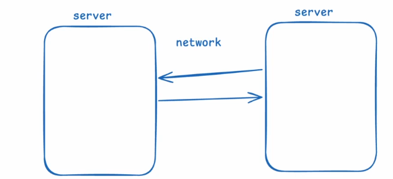
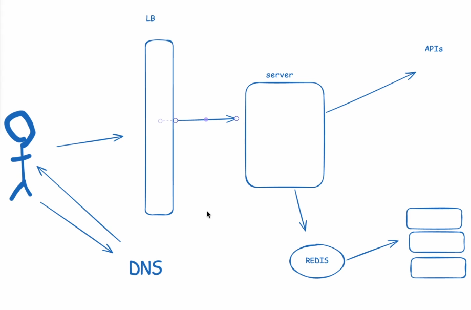

# Networking

## Redes

Antes de nos aprofundarmos em *networking*, precisamos entender a importância das redes, pois elas são fundamentais para a comunicação entre sistemas. Além disso, suas características influenciam diretamente:

- a latência;
- a escalabilidade;
- a segurança;
- a disponibilidade.

### Trade-offs de redes

Considere um sistema monolítico que utiliza um cache Redis executado na mesma máquina. Se movermos esse cache para outra máquina, como mostra a imagem abaixo, introduziremos comunicação pela rede:



Com essa mudança, a comunicação entre o servidor da aplicação e o servidor de cache precisará utilizar um protocolo de rede, como HTTP, TCP ou UDP. Isso traz alguns custos e riscos:

- **Latência:** a comunicação pela rede aumenta o tempo de resposta do sistema.
- **Falhas:** indisponibilidades, perda de pacotes e interrupções na conexão passam a afetar a operação.
- **Segurança:** um novo canal de comunicação amplia a superfície de ataque e precisa ser protegido.

Agora, considere a seguinte imagem:



Ela representa um sistema no qual a requisição do usuário passa pela resolução de DNS, pelo *load balancer* e, então, chega ao servidor da aplicação. Esse servidor também se comunica com o banco de dados, o Redis e APIs externas. Cada uma das setas mostradas representa uma comunicação que acrescenta algum tempo ao processamento da requisição.

Ao analisar um sistema distribuído, precisamos considerar:

- **Latência:** tempo necessário para que uma mensagem seja enviada e recebida, normalmente medido em milissegundos.
- **Largura de banda (*bandwidth*):** quantidade máxima de dados que uma rede consegue transmitir por unidade de tempo, normalmente medida em bits por segundo.
- **Taxa de transferência (*throughput*):** quantidade de dados efetivamente transmitida por unidade de tempo. Em geral, é menor que a largura de banda disponível.
- **TCP e UDP:** protocolos de transporte com características diferentes de confiabilidade, ordenação e latência.
- **HTTP e HTTPS:** protocolos utilizados na comunicação entre clientes e servidores. O HTTPS protege a comunicação HTTP com criptografia TLS.
- **Conexões:** canais de comunicação estabelecidos entre dois pontos por meio de protocolos específicos.
- **Políticas de repetição (*retries*):** regras que determinam quando e como uma requisição que falhou deve ser realizada novamente.

Esses fatores devem ser considerados ao projetar aplicações distribuídas. Uma aplicação baseada em *sockets*, por exemplo, possui limites de conexões simultâneas que podem afetar sua capacidade. Da mesma forma, em um jogo on-line, a escolha entre TCP e UDP pode influenciar significativamente o desempenho e a experiência dos usuários.

---

## Servidores

Existe uma diferença entre um servidor web (*web server*) e um servidor de aplicação (*application server*). O servidor web recebe requisições HTTP, pode entregar conteúdo estático e atuar como proxy reverso, usando ferramentas como Nginx ou Apache. Já o servidor de aplicação executa a lógica de negócio do *backend*, que pode ser implementado em JavaScript, Python, Java, entre outras linguagens.

Essa separação permite que o servidor de aplicação se concentre na lógica de negócio, enquanto o servidor web assume outras responsabilidades, como:

- roteamento;
- limitação da taxa de requisições (*rate limiting*);
- terminação TLS;
- aplicação de políticas de acesso e segurança;
- entrega de arquivos estáticos, como imagens, CSS e JavaScript;
- balanceamento de carga entre instâncias da aplicação.

Isso reduz a carga do servidor de aplicação. Além disso, ele pode ser escalado horizontalmente com a adição de novas instâncias, enquanto o servidor web distribui as requisições entre elas.

Essa arquitetura pode oferecer benefícios como:

- **Segurança:** adiciona uma camada intermediária e evita que o servidor de aplicação fique diretamente exposto a requisições externas.
- **Desempenho:** permite que tarefas como entrega de arquivos estáticos, compressão e gerenciamento de conexões sejam executadas por um componente especializado.
- **Confiabilidade (*reliability*):** possibilita o uso de verificações de integridade (*health checks*), limites de tempo (*timeouts*) e novas tentativas (*retries*).
- **Observabilidade:** centraliza a coleta de métricas e registros de acesso, facilitando o monitoramento e o diagnóstico de problemas.

---

## Protocolos e APIs

### REST

- É amplamente utilizado em APIs públicas.
- Normalmente utiliza métodos HTTP, como GET, POST, PUT e DELETE.
- Frequentemente utiliza JSON para representar os dados.
- É simples de implementar e consumir.
- É uma abordagem madura e possui um amplo ecossistema.

### gRPC

- Oferece alto desempenho e comunicação eficiente.
- Utiliza Protocol Buffers por padrão para serializar os dados.
- Oferece suporte a *streaming*.
- É frequentemente utilizado na comunicação entre serviços.

---

## HTTP e QUIC

O QUIC é um protocolo de transporte construído sobre UDP. Ele foi projetado para reduzir a latência no estabelecimento de conexões, oferece fluxos independentes de dados e incorpora segurança por meio do TLS.

Em relação às versões do HTTP:

- **HTTP/1.1 e HTTP/2:** normalmente utilizam TCP como protocolo de transporte.
- **HTTP/3:** utiliza QUIC, que opera sobre UDP.

Ao enviar uma requisição HTTPS por meio de TCP, normalmente ocorrem as seguintes etapas:

1. Resolução do DNS.
2. Estabelecimento da conexão TCP.
3. Negociação TLS (*TLS handshake*).
4. Envio da requisição HTTP.

O formato de uma requisição HTTP/1.1 é semelhante a este:

```http
GET /index.html HTTP/1.1
Host: example.com
User-Agent: Mozilla/5.0 (Windows NT 10.0; Win64; x64) AppleWebKit/537.36 (KHTML, like Gecko) Chrome/58.0.3029.110 Safari/537.3
Accept: text/html,application/xhtml+xml,application/xml;q=0.9,image/webp,*/*;q=0.8
```
