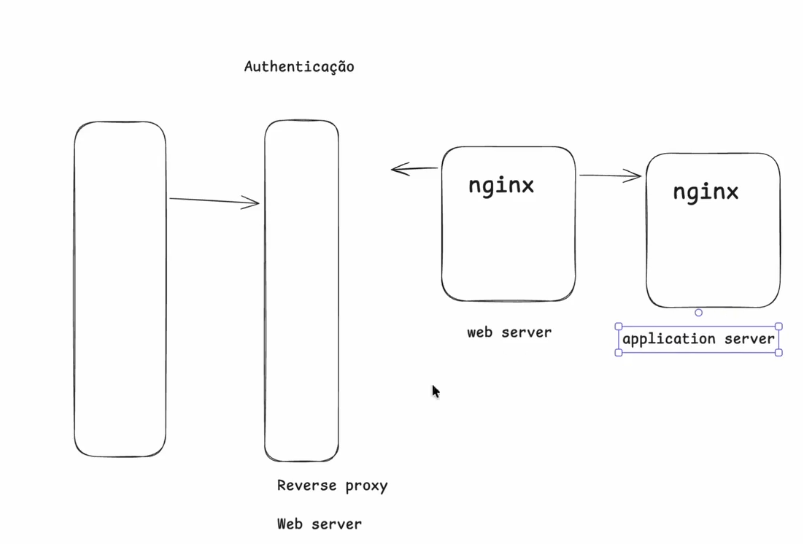

# Authentication e Authorization

Authentication é o ato de login em um app, já a Authorization é o ato de verificar se o usuário tem permissão para acessar um recurso.

### Autenticação

Normalmente envolve

- Segredo
- Posse
- Biometria

E pra isso normalmente usa-se 

- Passwords
- Tokens
- Face Id
- Biometria

Diferenças entre token e sessions

Uma sessão é uma conexão entre um cliente e um servidor que e armazenado em algum lugar como num Redis por exemplo que armazena um Session ID com um tempo de expiração definido

Já token é um identificador que permite acesso a um recurso.

Serviços de Auth
- Cognito - Serviço de autenticação e autorização da AWS
- OAuth - Serviço de autenticação via rede social ou link externo onde vc delega o login
- JWT - Serviço de autenticação via token, o bom dele é que não precisa de armazenamento de sessão. Trade-off é que como vc passou o token para o usuário, se ele for mal implementado, pode ter problema de SPOOFING que é um problema de segurança, além que é mais difícil de revogar, porque é um token que foi dado ao cliente e normalmente dentro do próprio token tem a data de expiração. Funciona bem em microserviços.
- 2FA - Serviço de autenticação via código enviado para o usuário
- Passkey - Serviço de autenticação via chave física ou biometria
- OpenID Connect - Serviço de autenticação via token, mas com suporte a provedores de identidade externos.
- Identity Provider - Serviço de autenticação via token, mas com suporte a provedores de identidade externos. Exemplo: Keycloak, Cognito, Auth0.

## Autorização

Autorização é o ato de verificar se o usuário tem permissão para acessar um recurso. Normalmente usa-se 

-  RBAC - Role Based Access Control - Autorização baseada em papéis, onde o usuário é associado a um papel e o papel tem permissões associadas a ele.
- ABAC - Attribute Based Access Control - Autorização baseada em atributos, onde o usuário tem permissões associadas a atributos do recurso.
- ACL - Access Control List - Autorização baseada em lista de permissões, onde o usuário tem permissões associadas a um recurso específico.
- GRANULAR - Autorização baseada em permissões granulares, onde o usuário tem permissões associadas a ações específicas em um recurso.

System Design com Auth

Nesse fluxo do exemplo a gente teria um Load Balancer, ou Proxy Reverso, ou Web Server e a camada de autenticação ficaria nessa camada. Apos essa camada teriamos um Nginx ou Apache com o web server que aponta pro Application Server tambem usando Nginx ou Apache. Porem o web server pode ser responsável pela autenticação. Isso pode ser feito tambem pelo Api Gateway. Isso pode ser feito pelo um Lambda. Ou seja, tem multiplas formas de implementar autenticação.

Logo apos a camada de autenticação, temos a camada de autorização. A camada de autenticação já validou o usuário então a próxima camada não precisa fazer isso novamente, onde a camada de autorização apenas verifica se o usuário tem permissão para acessar o recurso e por fim isso é executado na camada de Domain que seria a camada da lógica de negócio (API Backend).

---

### Proteção de Dados

- Acesso não autorizado
- Leaks
- Falhas de configuração
- Ameaças internas
- Integrações
- Autenticação externa

Para proteger os dados, vamos buscar seguir alguns princípios de segurança:

- Princípios de menor privilégio - O usuário deve ter apenas os privilégios necessários para realizar suas tarefas.
- Rotação de chaves - As chaves de acesso devem ser rotacionadas regularmente para evitar serem afetadas
- LGPD e GRPR - Os dados devem ser protegidos de acordo com as leis de proteção de dados (LGPD) e os direitos do usuário (GRPR).
- Criptografar todas as requests - Todas as requests devem ser criptografadas para evitar que sejam interceptadas.
- Usar TLS para proteger os dados em trânsito - TLS é um protocolo de criptografia que protege os dados em trânsito.
- HTTPs - HTTPS é uma extensão do HTTP que adiciona criptografia TLS para proteger os dados em trânsito.
- Dados criptografados no banco de dados - Os dados devem ser criptografados no banco de dados para evitar que sejam acessados por terceiros.
