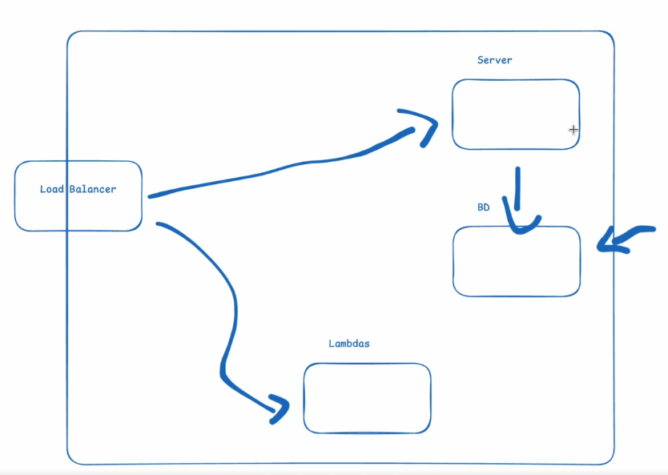

# DNS - Domain Name System

O DNS (Domain Name System) é um sistema de nomes de domínio que traduz nomes de domínio em endereços IP e deixa essa lista atualizada caso haja alterações nos registros.

Na prática, quando a gente acessa `youtube.com`, o DNS resolve o nome de domínio para um endereço IP correspondente. Seria muito difícil memorizar e digitar endereços IP, que ainda podem mudar conforme a infraestrutura do serviço.

## Como funciona o DNS

O DNS é uma infraestrutura hierárquica. O cliente normalmente faz uma consulta recursiva a um resolvedor, que fica responsável por buscar a resposta. Durante essa busca, o resolvedor faz consultas iterativas: consulta um servidor raiz, depois o servidor do TLD e, por fim, o servidor autoritativo do domínio.

## Oito passos de uma resolução DNS

1. O usuário digita `youtube.com` no navegador.
2. O navegador consulta o resolvedor DNS configurado, caso não encontre a resposta em seus caches.
3. O resolvedor consulta um servidor raiz.
4. O servidor raiz indica os servidores responsáveis pelo TLD `.com`.
5. O resolvedor consulta um servidor do TLD.
6. O TLD indica o servidor autoritativo de `youtube.com`.
7. O resolvedor consulta o servidor autoritativo e recebe o registro solicitado.
8. O resolvedor armazena a resposta em cache conforme o TTL e retorna o endereço ao cliente.

## Cache

O DNS cache é uma técnica utilizada para armazenar em cache os resultados de consultas DNS, para evitar consultas repetidas e acelerar o processo de resolução de nomes. Existem alguns tipos de cache:

- Cache do navegador.
- Cache do sistema operacional.
- Cache do resolvedor DNS, que pode ser operado pelo provedor de internet ou por outro serviço.

Somente quando a resposta não está em nenhum cache aplicável, o resolvedor percorre a hierarquia descrita acima. Isso diminui a latência e reduz a carga sobre a infraestrutura do DNS.

## Endereços IP

- Os endereços de IP são números que identificam cada dispositivo conectado a uma rede. Existem dois tipos de endereços de IP: IPv4 e IPv6.
  - **IPv4:** endereços de 32 bits, representados em notação decimal, como `192.168.1.1`.
  - **IPv6:** endereços de 128 bits, representados em notação hexadecimal, como `2001:db8:85a3::8a2e:370:7334`.
- O IPv6 é uma versão mais avançada do IPv4, por causa de uma limitação no número de endereços disponíveis em IPv4.
- Os endereços de IP podem ser públicos (acessíveis pela internet) ou privados (usados internamente em redes locais).
- A grande quantidade de endereços IPv6 facilita conectar muitos dispositivos, inclusive em cenários de IoT, mas não significa que todos precisem ficar expostos diretamente à internet.
- Nem todo site fica hospedado em um endereço IP exclusivo. Vários domínios podem compartilhar o mesmo IP e ser separados pelo cabeçalho `Host`, usando hospedagem virtual.
- IPs privados podem se repetir em redes diferentes. Uma impressora na minha casa pode ter o mesmo IP privado que um dispositivo em outra residência.
- IPs podem ser estáticos ou dinâmicos, dependendo da configuração da rede.

### IPs estáticos

- Ips estáticos são endereços de IP que não mudam, eles são configurados manualmente e não são atribuídos dinamicamente pelo servidor. 
- Normalmente eles são mais usados em Infra, Banco de Dados e outros serviços que não precisam de IPs dinâmicos.
- A vantagem do estático é que ele não muda, então é mais fácil de configurar e gerenciar.

### IPs dinâmicos

- Ips dinâmicos são endereços de IP que mudam automaticamente, eles são atribuídos dinamicamente pelo servidor. 
- Normalmente eles são mais usados em redes internas.
- A vantagem do dinâmico é que ele da mais flexibilidade. 

Assim como em uma casa existem dispositivos que não são acessíveis pela internet, uma arquitetura pode manter servidores de aplicação, bancos e funções em redes privadas. Apenas o Load Balancer fica exposto e distribui as requisições para os componentes internos.

É recomendável expor somente os componentes necessários, reduzindo a superfície de ataque.

---

## NAT Gateway
- O NAT Gateway é um serviço que permite que os recursos internos se comuniquem com a internet, mas que não permite que a internet se comunique com os recursos internos.
- Ele é usado para permitir que os recursos internos acessem a internet, mas que não permita que a internet acesse os recursos internos.
- Ele é configurado em uma sub-rede pública e é responsável por traduzir os endereços IP internos para endereços IP públicos.

---

## Políticas de roteamento DNS

1. Geolocation
   - O DNS Routing é usado para redirecionar o tráfego de acordo com a localização do usuário.
2. Failover
   - O Failover é usado para redirecionar o tráfego para outro servidor em caso de falha.
3. Latency-Based
   - O Latency-Based é usado para redirecionar o tráfego para o servidor com menor latência.
4. IP-Based
   - O IP-Based é usado para redirecionar o tráfego para o servidor com o endereço IP especificado.
5. Weighted
   - O Weighted é usado para redirecionar o tráfego para o servidor com base em um peso especificado.
6. Multi-Answer
   - O Multi-Answer retorna múltiplos registros saudáveis para distribuir o tráfego.
7. Round-Robin
   - O Round-Robin é usado para distribuir o tráfego entre vários servidores em ordem circular.
