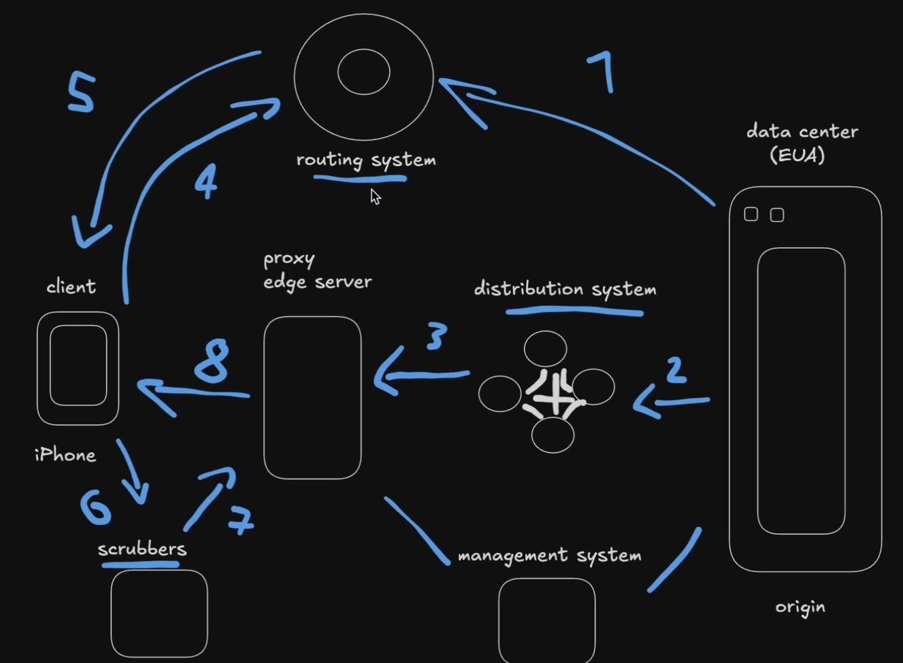

# CDN — Content Delivery Network

CDN é uma rede distribuída de servidores utilizada para entregar conteúdo aos usuários com menor latência e maior disponibilidade.

Para entender isso, imagine o seguinte cenário: uma plataforma de streaming possui o servidor de origem nos Estados Unidos. Se todos os usuários precisassem acessar os conteúdos diretamente desse servidor, usuários de países distantes poderiam enfrentar uma latência maior, além de aumentar a carga sobre o servidor de origem.

Para resolver esse problema, uma CDN utiliza servidores de borda, chamados de **Edge Servers**, distribuídos por diferentes regiões. Esses servidores podem armazenar cópias dos conteúdos mais acessados e entregá-los a partir de uma localização mais próxima ou com uma rota de rede mais eficiente para o usuário.

Além de reduzir a latência, uma CDN pode:

- Diminuir a carga no servidor de origem.
- Melhorar a disponibilidade do conteúdo.
- Absorver picos de tráfego.
- Armazenar conteúdos em cache.
- Reduzir o consumo de banda do servidor de origem.
- Proteger a aplicação contra tráfego malicioso e ataques DDoS.

---

## PoP e Edge Server

Um **PoP — Point of Presence** é uma localização física da CDN que contém um ou mais servidores de borda.

Uma CDN possui vários PoPs distribuídos geograficamente. Quando um cliente realiza uma requisição, ele é direcionado para o PoP considerado mais adequado.

Esse direcionamento pode considerar fatores como:

- Distância geográfica.
- Latência da rede.
- Capacidade disponível.
- Congestionamento.
- Saúde dos servidores.
- Custo e eficiência da rota de rede.

O usuário não é necessariamente direcionado ao servidor geograficamente mais próximo, mas ao servidor que oferece a melhor rota naquele momento.

---

## Funcionamento de uma CDN



O fluxo simplificado de uma CDN funciona da seguinte forma:

1. O servidor de origem disponibiliza o conteúdo.
2. O cliente tenta acessar um domínio ou recurso.
3. O sistema de roteamento da CDN, normalmente utilizando DNS, Anycast ou ambos, direciona o cliente para um Edge Server adequado.
4. O cliente realiza a requisição diretamente ao Edge Server.
5. O Edge Server verifica se o conteúdo está armazenado em cache.
6. Caso esteja, o conteúdo é entregue diretamente ao cliente.
7. Caso não esteja, o Edge Server busca o conteúdo no servidor de origem.
8. O conteúdo pode ser armazenado no Edge Server para futuras requisições e, em seguida, é entregue ao cliente.

A imagem apresenta uma arquitetura mais completa, contendo componentes como:

- **Origin:** servidor ou Data Center que armazena o conteúdo original.
- **Routing System:** direciona o cliente para o Edge Server mais adequado.
- **Distribution System:** distribui ou replica conteúdos entre os servidores da CDN.
- **Proxy/Edge Server:** recebe as requisições dos clientes, mantém conteúdos em cache e busca dados no servidor de origem quando necessário.
- **Management System:** monitora, configura e gerencia a infraestrutura da CDN.
- **Scrubbers:** analisam e filtram tráfego malicioso, principalmente durante ataques DDoS.

Os scrubbers não são necessariamente uma etapa obrigatória de todas as requisições. Dependendo da arquitetura, o tráfego pode passar permanentemente por eles ou ser redirecionado somente quando uma ameaça é detectada.

---

## Cache hit e cache miss

Quando um Edge Server recebe uma requisição, existem dois cenários principais:

### Cache hit

O conteúdo solicitado já está armazenado no Edge Server.

Nesse caso, o conteúdo é entregue diretamente ao cliente, sem consultar o servidor de origem.

### Cache miss

O conteúdo solicitado não está armazenado no Edge Server ou está expirado.

Nesse caso, o Edge Server busca o conteúdo no servidor de origem, entrega ao cliente e pode armazenar uma cópia para atender futuras requisições.

---

## TTL e expiração

Os conteúdos armazenados na CDN normalmente não permanecem no cache indefinidamente.

O **TTL — Time to Live** define por quanto tempo um conteúdo pode permanecer armazenado antes de ser considerado expirado.

Por exemplo:

```http
Cache-Control: public, max-age=3600
```

Nesse caso, o conteúdo pode permanecer em cache por 3.600 segundos, ou seja, uma hora.

Depois que o TTL expira, o Edge Server pode buscar novamente o conteúdo no servidor de origem.

---

## Invalidação de cache

Quando um arquivo é atualizado no servidor de origem, a CDN pode continuar entregando a versão antiga até o TTL expirar.

Para evitar esse problema, pode ser realizada uma **invalidação de cache**, também chamada de **purge**, removendo antecipadamente o conteúdo dos servidores de borda.

Outra estratégia comum é utilizar versionamento no nome dos arquivos:

```text
app.a81c93.js
```

Quando o conteúdo do arquivo muda, seu nome também muda. Dessa forma, a CDN trata a nova versão como um recurso diferente e não entrega a versão antiga armazenada em cache.

---

## Conteúdo estático e dinâmico

CDNs são muito utilizadas para distribuir conteúdos estáticos, como:

- Imagens.
- Vídeos.
- Arquivos CSS.
- Arquivos JavaScript.
- Fontes.
- Documentos.
- Downloads.

Conteúdos dinâmicos também podem ser acelerados por uma CDN, mas normalmente não são armazenados da mesma forma que arquivos estáticos.

Nesse cenário, a CDN pode:

- Melhorar a rota de rede.
- Reutilizar conexões.
- Realizar terminação TLS.
- Aplicar regras específicas de cache.
- Comprimir respostas.
- Proteger endpoints com WAF e rate limiting.

---

## Push CDN vs Pull CDN

Existem duas estratégias principais para disponibilizar conteúdo em uma CDN.

### Push CDN

Na **Push CDN**, o conteúdo é enviado previamente do servidor de origem para a CDN antes de ser solicitado pelos clientes.

A aplicação ou o responsável pela infraestrutura controla quando os arquivos são publicados, atualizados ou removidos.

Essa estratégia pode ser útil quando:

- Os arquivos são grandes.
- O conteúdo muda com pouca frequência.
- É necessário controlar exatamente o que será distribuído.
- O conteúdo precisa estar disponível antes da primeira requisição.

### Pull CDN

Na **Pull CDN**, o conteúdo permanece inicialmente no servidor de origem.

Quando um cliente solicita um arquivo que ainda não está armazenado no Edge Server, a CDN busca esse conteúdo no servidor de origem, entrega ao cliente e armazena uma cópia para futuras requisições.

Essa estratégia é mais simples de configurar e muito utilizada para sites, APIs e aplicações web.

---

## Benefícios de uma CDN

Os principais benefícios de uma CDN são:

- Menor latência.
- Menor carga no servidor de origem.
- Maior disponibilidade.
- Melhor escalabilidade.
- Redução do consumo de banda no origin.
- Melhor desempenho durante picos de acesso.
- Proteção contra ataques DDoS.
- Distribuição global de conteúdo.

---

## Limitações e desafios

Apesar dos benefícios, o uso de uma CDN também possui alguns desafios:

- Conteúdo desatualizado no cache.
- Necessidade de configurar corretamente TTL e invalidação.
- Aumento da complexidade da infraestrutura.
- Custos de transferência e armazenamento.
- Dificuldade para cachear conteúdos personalizados por usuário.
- Necessidade de proteger o acesso direto ao servidor de origem.
