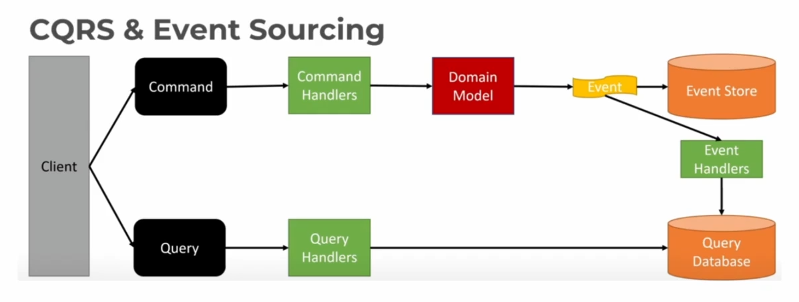

# CQRS — Command Query Responsibility Segregation

CQRS é um padrão que separa o modelo usado para alterar o estado do sistema do modelo usado para consultá-lo.

- **Command:** representa a intenção de alterar o estado, como `CreateOrder` ou `CancelOrder`. Pode ser rejeitado pelas regras de negócio.
- **Query:** solicita dados e, idealmente, não produz efeitos colaterais.

Essa separação pode ser apenas lógica, dentro da mesma aplicação e do mesmo banco de dados. Em cenários mais complexos, o modelo de escrita e o modelo de leitura podem usar serviços, bancos e escalas diferentes.



## Como funciona

No fluxo de escrita, o cliente envia um comando para um *command handler*. O handler executa as regras de negócio e persiste a alteração no modelo de escrita. A operação pode publicar um evento, que será consumido por um projetor para atualizar um modelo de leitura.

No fluxo de leitura, um *query handler* consulta o modelo otimizado para leitura e devolve a resposta ao cliente. Esse modelo pode ser uma tabela desnormalizada, uma *materialized view*, um banco NoSQL ou um índice de busca, dependendo do padrão de acesso.

A imagem combina CQRS com Event Sourcing. Nesse caso, o modelo de escrita persiste eventos em um Event Store, e os eventos alimentam o banco de leitura. Porém, isso é uma combinação possível, e não uma exigência do CQRS: também é possível usar CQRS com um banco relacional comum como fonte de escrita.

É importante não confundir os termos:

- Um **command** é uma solicitação do que deve acontecer.
- Um **event** é o registro de algo que já aconteceu.
- Um **Event Store** só é necessário quando o sistema adota Event Sourcing ou precisa de um armazenamento específico de eventos.

## Exemplo prático

O cliente envia um comando para criar um pedido:

```json
{
  "command_type": "CreateOrder",
  "customer_id": "123e4567-e89b-12d3-a456-426614174000",
  "items": [
    {
      "product_id": "1dfasfasf-7e89-4b12-a456-426614174000",
      "quantity": 1,
      "unit_price": 100.0
    },
    {
      "product_id": "15314dfa-fasf-4131-9abc-123456789000",
      "quantity": 1,
      "unit_price": 50.0
    }
  ]
}
```

Depois que o comando é validado e persistido, o sistema pode publicar um evento como `OrderCreated`. Um projetor consome esse evento e atualiza uma visão de leitura, por exemplo:

```json
{
  "order_id": "ord-001",
  "customer_id": "123e4567-e89b-12d3-a456-426614174000",
  "status": "created",
  "total": 150.0
}
```

Se a projeção for assíncrona, pode existir um pequeno intervalo em que a escrita já foi confirmada, mas a consulta ainda não mostra o novo pedido. Esse é um trade-off comum do CQRS.

## Vantagens

- **Escalabilidade independente:** leitura e escrita podem ser escaladas de forma diferente quando os padrões de carga também são diferentes.
- **Modelos especializados:** cada lado pode ser modelado para seu objetivo, sem obrigar o modelo de escrita a atender consultas complexas.
- **Flexibilidade:** uma mesma fonte de mudanças pode alimentar várias projeções, como uma tela de pedidos, um índice de busca e uma visão para analytics.
- **Separação de responsabilidades:** comandos concentram regras de negócio; queries podem ser mais simples e eficientes.

## Desvantagens e cuidados

- **Complexidade:** há mais modelos, componentes e fluxos para operar e monitorar.
- **Consistência eventual:** uma projeção assíncrona pode ficar temporariamente desatualizada.
- **Falhas na projeção:** o projetor precisa de retries, idempotência e uma forma de reprocessar eventos ou mudanças.
- **Custo adicional:** manter outro banco, índices ou infraestrutura nem sempre compensa.
- **Leitura após escrita:** se o usuário precisar enxergar imediatamente a alteração, é necessário definir uma estratégia, como ler temporariamente do modelo de escrita ou aguardar a projeção.

CQRS não torna o sistema automaticamente auditável. A auditabilidade e a reconstrução do estado a partir de eventos vêm principalmente do Event Sourcing ou de outro mecanismo de histórico.

## Quando usar

CQRS costuma fazer sentido quando:

- o sistema tem muita leitura e pouca escrita, ou o contrário;
- as consultas exigem uma estrutura muito diferente da usada nas regras de negócio;
- existem várias projeções ou formatos de leitura;
- o domínio possui regras de escrita complexas e precisa de modelos bem separados.

Para um CRUD simples, separar modelos e bancos normalmente adiciona complexidade sem um benefício proporcional. Em uma entrevista, é suficiente começar com um único modelo e introduzir CQRS quando um requisito justificar a separação.
