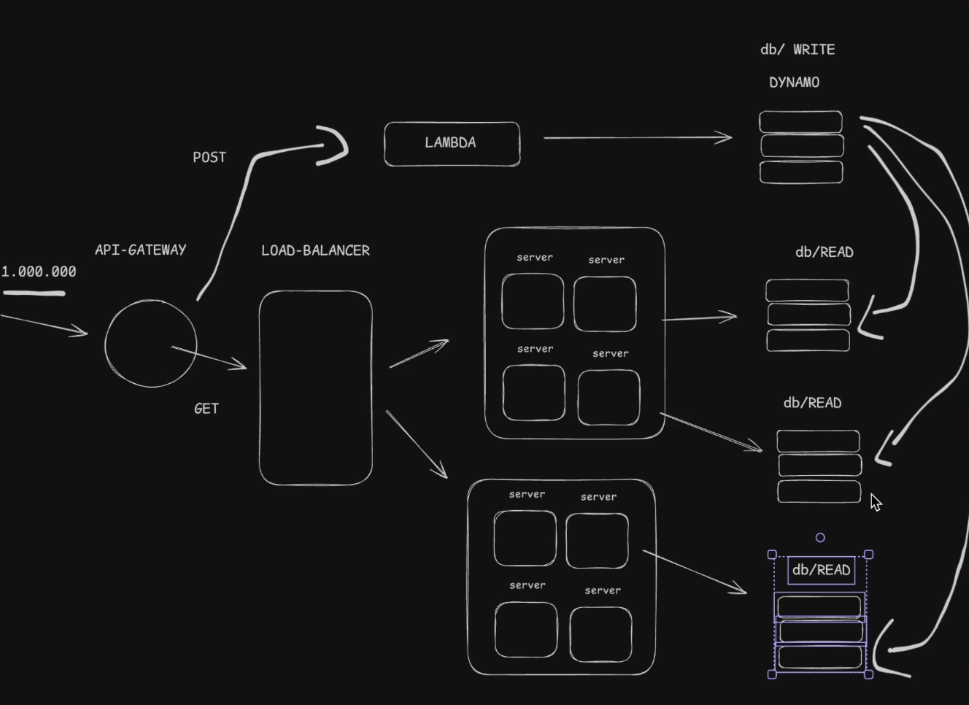

# Design de Alto Nível

A ideia do Design de Alto Nível em uma entrevista de System Design é levantar uma visão geral do sistema a ser desenvolvido, entendendo os requisitos e o contexto do projeto.

Exemplo: se nos propuserem desenvolver um encurtador de URLs, o Design de Alto Nível consiste em entender os requisitos e o contexto do projeto e levantar uma visão geral do sistema a ser desenvolvido.

Vamos supor que, após fazermos algumas perguntas ao entrevistador, chegamos aos seguintes requisitos:

- Precisamos encurtar URLs e lidar com a geração de IDs exclusivos.
- Precisamos lidar com 10 milhões de URLs únicas.
- Precisamos lidar com 1 milhão de requisições.

# Etapas

A primeira etapa seria pensar em formas de lidar com a geração de URLs únicas. Existem algumas maneiras de fazer isso; não precisamos conhecer todos os detalhes, apenas levantar uma ideia geral do que pode ser feito. Por exemplo:

- Hashing Function
- UUID
- Sequential IDs

Trabalhar com IDs sequenciais pode não ser a melhor opção, pois isso pode gerar problemas de concorrência e desempenho. Funções de hash e UUIDs são outras opções mais escaláveis.

Depois, é preciso pensar no que será salvo no banco de dados. A partir disso, podemos decidir qual opção é mais adequada para o projeto.

Nesse caso, precisaríamos salvar o ID, a URL original e a URL encurtada. A URL encurtada talvez nem precisasse ser armazenada se usássemos o ID para gerá-la. Sabendo disso, poderíamos usar tanto um banco de dados relacional quanto um NoSQL. Porém, o objetivo da escolha do banco é mostrar ao entrevistador qual opção seria mais adequada para o projeto, apresentando uma justificativa.

Depois disso, a ideia seria montar um System Design começando de forma simples e escalando gradualmente conforme os gargalos fossem identificados. O primeiro design seria:

Exemplo: requisição -> servidor -> banco de dados. Se um servidor não suportar todas as requisições, será necessário adicionar mais servidores. Nesse caso, precisamos lidar com a distribuição das requisições entre eles e, por isso, utilizamos um load balancer para distribuir a carga. Assim, aumentamos gradualmente a capacidade do sistema.

