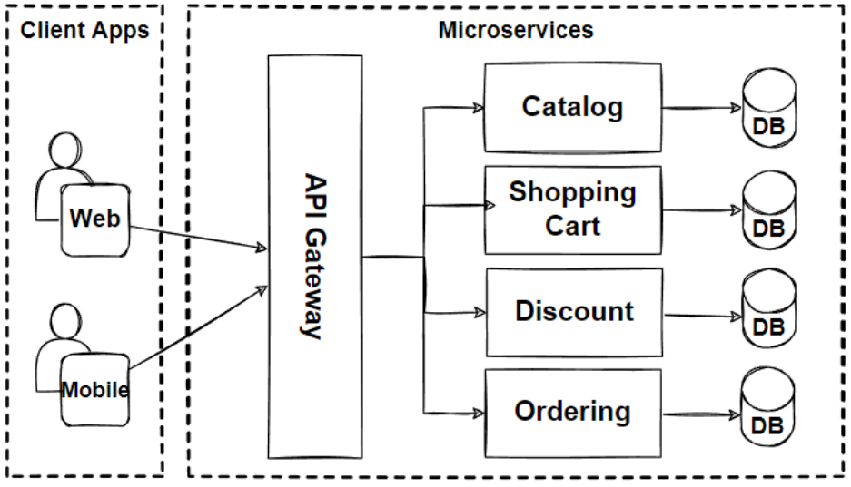

# Microserviços x monolito

## Microserviços

Microserviços, como o próprio nome sugere, são serviços pequenos e independentes. Normalmente, cada microserviço é responsável por uma capacidade específica da aplicação e possui algumas características:

- Autônomo
- Responsabilidade bem definida
- Base de código independente
- Responsável pelos próprios dados
- Deploy independente
- Ambiente de execução independente

Não necessariamente todas essas características precisam estar presentes para que um serviço seja considerado um microserviço. Porém, geralmente esse é o padrão utilizado no mercado.

Conforme a imagem, temos quatro microserviços: catálogo, carrinho de compras, descontos e pedidos. Cada um deles é responsável por uma parte específica da aplicação e pode possuir sua própria base de código, banco de dados e ambiente de execução.

Esses serviços podem se comunicar entre si por meio de chamadas síncronas, como HTTP, ou de maneira assíncrona, utilizando filas e eventos.

A ideia é que cada microserviço cuide de uma capacidade específica da aplicação e faça isso bem. Por exemplo, o serviço de pedidos não deve ser responsável por controlar diretamente o carrinho de compras do usuário, pois essa responsabilidade pertence ao serviço de carrinho.

Microserviços costumam ser mais adequados quando a aplicação possui uma grande complexidade de domínio, precisa escalar partes diferentes de forma independente ou possui vários times trabalhando no mesmo sistema.

Porém, sua manutenção é mais complexa e custosa do que a de um monolito. Com vários times, cada equipe pode assumir a responsabilidade por um ou mais serviços, trabalhando e realizando deploys de maneira independente.

### Vantagens

- Escalabilidade independente
- Deploy independente
- Times mais autônomos
- Desenvolvimento em paralelo
- Isolamento de falhas
- Possibilidade de utilizar tecnologias diferentes em cada serviço

O isolamento de falhas não é automático. Caso um serviço dependa diretamente de outro, uma falha pode se propagar pelo sistema.

### Desvantagens

- Maior complexidade operacional
- Consistência de dados mais difícil
- Comunicação entre serviços
- Debug mais difícil, pois uma requisição pode passar por vários serviços
- Maior necessidade de logs, métricas e tracing distribuído
- Testes de integração mais complexos
- Deploy e infraestrutura mais complexos
- Maior custo de manutenção

---

## Monolito

Em uma arquitetura monolítica, a maior parte da aplicação é desenvolvida, empacotada, distribuída e executada como uma única unidade.

Isso não significa que todo o código precisa ficar misturado. Um monolito pode ser dividido internamente em módulos, camadas e domínios bem definidos.

Normalmente, um monolito possui:

- Uma única base de código
- Um único processo ou aplicação executável
- Deploy realizado como uma única unidade
- Banco de dados compartilhado entre os módulos
- Comunicação interna realizada diretamente pelo código
- Infraestrutura mais simples

### Vantagens

- Desenvolvimento inicial mais simples
- Deploy mais simples
- Debug mais fácil
- Testes de integração mais simples
- Autenticação e autorização centralizadas
- Menor complexidade operacional
- Adequado para aplicações pequenas e médias
- Adequado para equipes pequenas

### Desvantagens

- Toda a aplicação precisa ser implantada novamente após uma alteração
- Escalabilidade normalmente ocorre para a aplicação inteira
- Uma falha pode afetar todo o sistema
- O código pode ficar muito acoplado caso não exista uma boa organização
- Pode dificultar o trabalho de vários times no mesmo projeto
- O tempo de build, testes e deploy pode crescer conforme a aplicação aumenta

---

## Monolito ou microserviços?

Microserviços não são necessariamente melhores do que um monolito. As duas arquiteturas possuem vantagens e desvantagens.

Para a maioria das aplicações e equipes pequenas, começar com um monolito bem organizado costuma ser a alternativa mais simples. Conforme o sistema cresce e surgem necessidades claras de escalabilidade, autonomia entre times ou separação de domínios, algumas partes podem ser extraídas para microserviços.

A escolha depende das necessidades do sistema, da complexidade do domínio, do tamanho da equipe e da capacidade da empresa de operar uma arquitetura distribuída.
