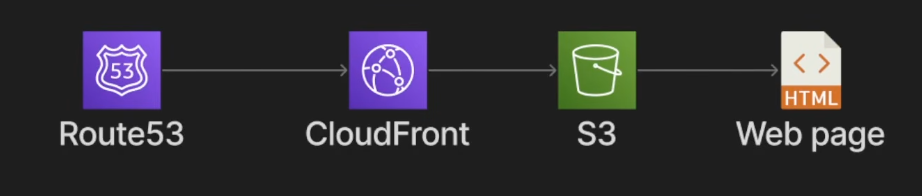
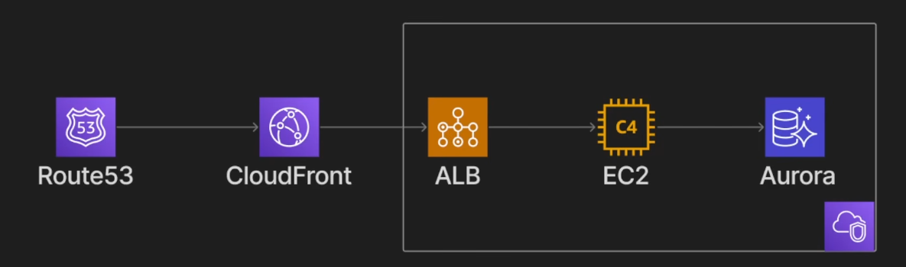
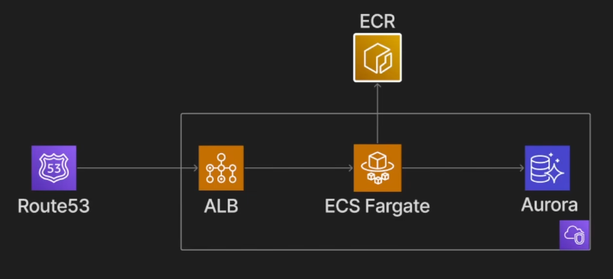
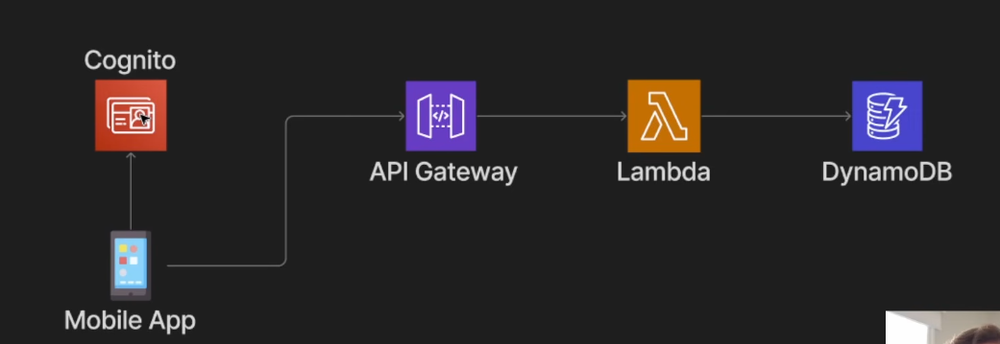
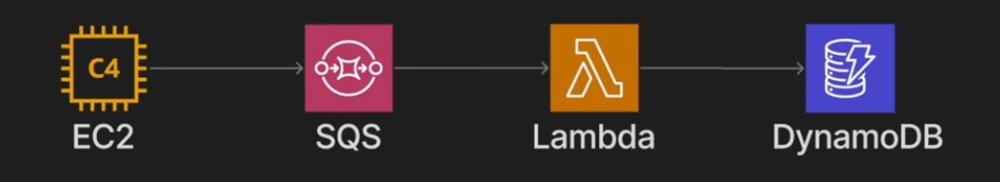
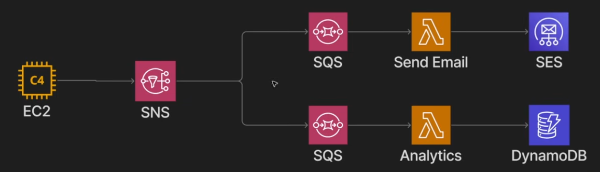
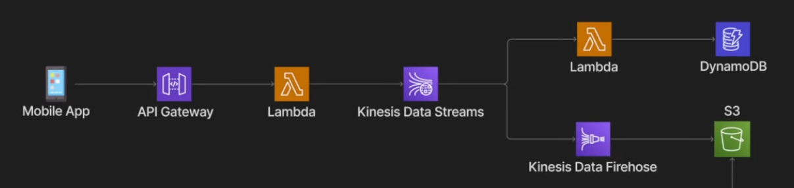
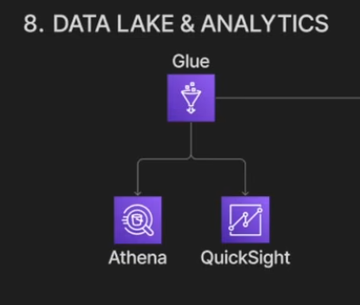

# Arquiteturas na AWS

### 1 - Static Website

Essa arquitetura é indicada para sites estáticos, como landing pages, documentações e SPAs feitas com React, Angular ou Vue quando o build final gera apenas arquivos HTML, CSS, JavaScript e assets.

Principais serviços:

- **Route 53**: serviço de DNS. Resolve o domínio da aplicação.
- **CloudFront**: CDN da AWS. Entrega o conteúdo a partir de edge locations, melhora latência, permite cache e centraliza HTTPS/TLS.
- **S3**: armazena os arquivos estáticos do site.

Fluxo da arquitetura:

1. O usuário acessa o domínio.
2. O **Route 53** resolve o domínio para uma distribuição do **CloudFront**.
3. O **CloudFront** busca os arquivos no bucket **S3** quando eles ainda não estão em cache.
4. O usuário recebe os arquivos estáticos do site.

Vantagens:

- Não exige gerenciamento de servidores.
- Escala muito bem para tráfego alto.
- Costuma ser barata, principalmente para sites simples.
- CloudFront reduz latência e protege a origem S3.
- O bucket S3 pode ficar privado, liberando acesso apenas pelo CloudFront.

Limitações:

- Não executa código de servidor por requisição, como PHP, SSR completo ou APIs próprias.
- Para rotas client-side em uma SPA, é comum configurar fallback para `index.html`.
- Funcionalidades dinâmicas, como autenticação, formulários e pagamentos, precisam de uma API separada ou serviços adicionais.

---

### 2 - Web App

Essa arquitetura atende aplicações web tradicionais com backend, APIs, renderização server-side ou serviços que precisam rodar continuamente em servidores.

Principais serviços:

- **Route 53**: DNS do domínio.
- **CloudFront**: CDN que pode cachear conteúdo estático e encaminhar requisições dinâmicas para a aplicação.
- **ALB - Application Load Balancer**: balanceador de carga HTTP/HTTPS. Distribui requisições entre instâncias EC2 e faz health checks.
- **EC2 - Elastic Compute Cloud**: máquinas virtuais onde a aplicação roda.
- **Aurora**: banco relacional gerenciado compatível com PostgreSQL ou MySQL.
- **VPC - Virtual Private Cloud**: rede isolada onde ficam ALB, EC2, banco de dados, subnets e security groups.

Fluxo da arquitetura:

1. O usuário acessa o domínio.
2. O **Route 53** aponta para o **CloudFront**.
3. O **CloudFront** encaminha requisições dinâmicas para o **ALB**.
4. O **ALB** distribui a carga entre uma ou mais instâncias **EC2**.
5. A aplicação na EC2 processa a requisição e, quando necessário, acessa o **Aurora**.

Pontos importantes:

- Em produção, o ideal é ter mais de uma instância EC2 em zonas de disponibilidade diferentes.
- O **Auto Scaling Group** pode aumentar ou reduzir a quantidade de instâncias conforme CPU, memória, número de requisições ou outras métricas.
- O **ALB** também ajuda em deploys, health checks, TLS e roteamento por path ou host.
- O banco normalmente fica em subnets privadas, acessível apenas pela aplicação.
- Para um projeto muito pequeno, uma única EC2 sem ALB pode ser mais simples, mas perde alta disponibilidade e facilita menos a evolução.

Vantagens:

- Dá bastante controle sobre sistema operacional, runtime, Nginx, Apache, processos e bibliotecas.
- Funciona bem para aplicações legadas ou stacks que precisam de configuração específica de servidor.
- Pode escalar horizontalmente usando ALB e Auto Scaling.
- Aurora reduz parte do trabalho operacional do banco, como backups, replicação e failover.

Desvantagens:

- Exige gerenciamento de servidores, patches, runtime, deploy, logs e monitoramento.
- A configuração de rede, segurança e alta disponibilidade fica mais trabalhosa.
- EC2 e ALB podem gerar custo mesmo em períodos de baixo tráfego.
- É preciso cuidar de hardening, secrets, backups, alarmes e recuperação de falhas.

---

### 3 - Aplicação Containerizada com ECS Fargate

Essa arquitetura é indicada quando queremos executar aplicações em containers sem administrar instâncias EC2 diretamente.

A ideia é empacotar a aplicação em uma imagem Docker, publicar essa imagem no **ECR** e executar o container no **ECS Fargate**. A AWS provisiona a capacidade necessária para rodar as tasks, enquanto o ECS gerencia a orquestração.

Principais serviços:

- **Route 53**: resolve o domínio da aplicação.
- **ALB - Application Load Balancer**: recebe requisições HTTP/HTTPS e encaminha para as tasks do ECS.
- **ECR - Elastic Container Registry**: registry de imagens Docker da AWS.
- **ECS - Elastic Container Service**: orquestrador de containers. Gerencia services, tasks, réplicas e integração com o Load Balancer.
- **Fargate**: modo serverless para executar containers sem gerenciar EC2.
- **Aurora**: banco relacional gerenciado compatível com MySQL ou PostgreSQL.

Fluxo da arquitetura:

1. O usuário acessa o domínio.
2. O **Route 53** direciona a requisição para o **ALB**.
3. O **ALB** encaminha a requisição para uma task saudável no **ECS Fargate**.
4. O container processa a requisição.
5. A aplicação acessa o **Aurora** quando precisa persistir ou consultar dados.
6. Durante o deploy ou início de uma task, o ECS baixa a imagem armazenada no **ECR**.

Pontos importantes:

- O ALB costuma ficar em subnets públicas, enquanto as tasks e o banco ficam em subnets privadas.
- A task definition define imagem, CPU, memória, variáveis de ambiente, secrets, portas e logs.
- O ECS Service mantém a quantidade desejada de tasks rodando e substitui tasks com falha.
- É possível configurar Auto Scaling por CPU, memória, fila, requisições ou métricas customizadas.

Vantagens:

- Não precisa gerenciar servidores EC2 diretamente.
- É uma boa opção para APIs, backends e serviços web em produção.
- Mantém o empacotamento da aplicação padronizado com Docker.
- Integra bem com ECR, ALB, CloudWatch, IAM, Secrets Manager e Aurora.
- Dá mais controle de rede e infraestrutura do que soluções mais simples como App Runner.

Desvantagens:

- É mais complexo de configurar do que App Runner ou Lambda.
- Envolve mais componentes: VPC, subnets, security groups, ALB, target group, task definition e service.
- Pode ficar caro dependendo de CPU, memória, tráfego, Load Balancer e banco de dados.
- Exige conhecimento maior de rede, deploy e observabilidade na AWS.

---

### 4 - Serverless API

Essa arquitetura é útil quando queremos executar código somente quando uma requisição chega, sem manter servidores ou containers rodando o tempo todo.

Principais serviços:

- **Cognito**: autenticação e autorização de usuários. Pode emitir tokens usados pela aplicação.
- **API Gateway**: expõe endpoints HTTP/REST, aplica autenticação, throttling, logs e roteamento.
- **Lambda**: executa o código da aplicação sob demanda.
- **DynamoDB**: banco NoSQL gerenciado, com baixa latência e alta escalabilidade.

Fluxo da arquitetura:

1. O app mobile autentica o usuário usando **Cognito**.
2. O app chama uma rota no **API Gateway**, normalmente enviando um token.
3. O **API Gateway** valida a requisição e aciona uma função **Lambda**.
4. A **Lambda** executa a regra de negócio.
5. A função lê ou grava dados no **DynamoDB**.

Vantagens:

- Não há servidor ocioso para manter.
- Escala automaticamente conforme o número de requisições.
- O custo tende a acompanhar o uso real.
- Combina bem com APIs pequenas, mobile backends, webhooks e automações.

Desvantagens:

- Pode haver cold start, principalmente em funções menos acessadas.
- Lambda tem limite de tempo de execução e não é ideal para processos longos.
- Debug local, observabilidade e versionamento de funções exigem disciplina.
- É preciso projetar funções sem depender de estado em memória entre execuções.

---

### 5 - Async Processing

Essa arquitetura é indicada quando uma operação não precisa ser concluída durante a requisição principal. Um exemplo comum é um e-commerce: depois que o pedido é criado, tarefas como emissão de nota, envio de e-mail e atualização de relatórios podem ser processadas em segundo plano.

Principais serviços:

- **EC2**: aplicação principal que produz mensagens.
- **SQS - Simple Queue Service**: fila gerenciada para desacoplar produtor e consumidor.
- **Lambda**: consome mensagens da fila e processa a tarefa.
- **DynamoDB**: armazena o resultado do processamento.

Fluxo da arquitetura:

1. A aplicação na **EC2** recebe uma ação do usuário.
2. Em vez de processar tudo de forma síncrona, ela publica uma mensagem na **SQS**.
3. A **Lambda** consome mensagens da fila.
4. A função processa a tarefa e grava o resultado no **DynamoDB**.

Pontos importantes:

- A SQS ajuda a absorver picos de tráfego.
- Se o consumidor falhar, a mensagem pode voltar para a fila e ser tentada novamente.
- Uma **DLQ - Dead Letter Queue** é recomendada para mensagens que falham várias vezes.
- O consumidor deve ser idempotente, porque mensagens podem ser entregues mais de uma vez.

Vantagens:

- Reduz o tempo de resposta da requisição principal.
- Desacopla a aplicação que produz o evento da aplicação que processa.
- Melhora resiliência durante picos ou falhas temporárias.

Limitações:

- O resultado é eventualmente consistente.
- A ordem global das mensagens não é garantida em filas SQS Standard.
- Para ordem estrita e deduplicação, pode ser necessário usar SQS FIFO.

---

### 6 - Pub/Sub Fan-Out

Essa arquitetura resolve o caso em que vários sistemas precisam reagir ao mesmo evento. Se todos consumirem diretamente a mesma fila SQS, uma mensagem processada por um consumidor deixa de estar disponível para os outros. Com fan-out, o evento é publicado uma vez e replicado para múltiplos destinos.

Principais serviços:

- **SNS - Simple Notification Service**: tópico pub/sub que recebe eventos e os distribui para assinantes.
- **SQS - Simple Queue Service**: cada consumidor pode ter sua própria fila.
- **Lambda**: processa mensagens de cada fila.
- **SES - Simple Email Service**: serviço para envio de e-mails.
- **DynamoDB**: armazena dados processados, como eventos de analytics.

Fluxo da arquitetura:

1. A aplicação na **EC2** publica um evento no tópico **SNS**.
2. O **SNS** entrega uma cópia do evento para cada fila **SQS** inscrita.
3. Uma fila pode acionar uma Lambda de envio de e-mail, que usa **SES**.
4. Outra fila pode acionar uma Lambda de analytics, que grava no **DynamoDB**.

Vantagens:

- Permite que vários sistemas processem o mesmo evento de forma independente.
- Cada consumidor tem sua própria fila, retry, DLQ e ritmo de processamento.
- Evita acoplamento direto entre o produtor e todos os consumidores.
- Novos consumidores podem ser adicionados sem alterar o produtor.

Cuidados:

- A entrega costuma ser pelo menos uma vez, então consumidores devem ser idempotentes.
- É importante monitorar filas, DLQs e atrasos de processamento.
- Filtros de assinatura no SNS ajudam a enviar apenas eventos relevantes para cada consumidor.

---

### 7 - Real Time Streaming

Essa arquitetura é indicada para ingestão contínua de eventos, como cliques, telemetria, logs, localização, métricas de dispositivos ou eventos de um app mobile.

Principais serviços:

- **API Gateway**: recebe eventos do app ou de clientes externos.
- **Lambda**: valida, transforma ou enriquece os eventos antes de publicá-los no stream.
- **Kinesis Data Streams**: stream para ingestão e processamento em tempo quase real.
- **Kinesis Data Firehose**: entrega dados do stream para destinos como S3.
- **DynamoDB**: pode armazenar agregações, estado atual ou consultas de baixa latência.
- **S3**: armazena eventos brutos ou processados para histórico e analytics.

Fluxo da arquitetura:

1. O app mobile envia eventos para o **API Gateway**.
2. Uma **Lambda** recebe a requisição, valida o payload e publica no **Kinesis Data Streams**.
3. Um consumidor Lambda lê o stream e atualiza dados no **DynamoDB**.
4. O **Kinesis Data Firehose** entrega os eventos no **S3** para retenção e análise posterior.

Vantagens:

- Suporta grande volume de eventos contínuos.
- Permite múltiplos consumidores lendo o mesmo stream.
- Mantém ordenação por partition key.
- Facilita criar pipelines para processamento em tempo real e analytics histórico.

Cuidados:

- A escolha da partition key afeta distribuição de carga e ordenação.
- É preciso dimensionar shards ou usar modo on-demand conforme o volume.
- Streaming é mais complexo do que SQS/SNS para casos simples.
- Consumidores devem lidar com retries, duplicidade e checkpoints.

---

### 8 - Data Lake e Analytics

Essa arquitetura é usada para armazenar grandes volumes de dados e permitir consultas analíticas sem precisar carregar tudo em um banco relacional tradicional.

Principais serviços:

- **S3**: armazenamento central do data lake, geralmente separado em camadas como raw, curated e analytics.
- **Glue**: serviço de ETL e catálogo de dados. Pode descobrir schemas, catalogar tabelas e transformar dados.
- **Athena**: permite consultar dados no S3 usando SQL.
- **QuickSight**: ferramenta de BI para criar dashboards e visualizações.

Fluxo da arquitetura:

1. Dados brutos chegam ao **S3** por batch, streaming, exportações ou integrações.
2. O **Glue** cataloga os datasets e pode executar transformações.
3. O **Athena** consulta os dados catalogados usando SQL.
4. O **QuickSight** usa os resultados para dashboards e análises.

Vantagens:

- Permite armazenar dados estruturados, semiestruturados e brutos no mesmo repositório.
- Separa armazenamento de processamento.
- Athena evita manter um cluster ativo só para consultas eventuais.
- QuickSight facilita a camada de visualização para áreas de negócio.

Cuidados:

- O custo do Athena depende da quantidade de dados lidos por consulta.
- Formatos colunares, como Parquet, e particionamento reduzem custo e melhoram performance.
- É importante controlar permissões com IAM, Glue Data Catalog e, em cenários maiores, Lake Formation.
- Sem governança, o data lake pode virar apenas um depósito desorganizado de arquivos.
