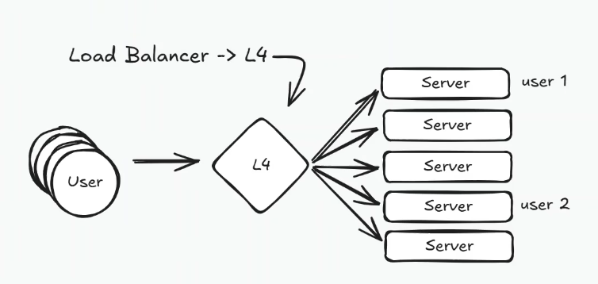

# WebSockets

- Permite comunicação bidirecional.
- Oferece baixa latência depois que a conexão é estabelecida.
- Trafega texto e frames binários.

Exemplo: 

```javascript
const chat = new WebSocket('wss://chat.myapp.com/ws');

chat.onmessage = (event) => {
    const msg = JSON.parse(event.data);
    appendMessage(msg); // Ana: "Opa, tudo bem?"
};

chat.send(JSON.stringify({
    type: 'message',
    text: 'Tudo certo!'
}));
```

No HTTP/1.1, a conexão pode começar com uma requisição de upgrade semelhante a esta:

```text
GET /chat HTTP/1.1
Upgrade: websocket
Connection: Upgrade
Sec-WebSocket-Key: ...
```

Depois que o servidor aceita o upgrade, cliente e servidor passam a trocar frames WebSocket sobre a mesma conexão TCP.

## Onde é usado?

- Chats
- Colaboração em tempo real, como Google Docs e Figma.


## Trade-off

- **Complexidade:** exige gerenciar conexões longas, reconexão, heartbeat, backpressure e distribuição de mensagens.

Exemplo:

Um servidor com

```text
- 16 cores
- 32GB RAM
- Mensagens com média de 1KB (1000 caracteres)
- 100 mil mensagens por segundo no total (considerando todos os usuários conectados)
```

A quantidade de conexões simultâneas não pode ser estimada apenas por CPU e RAM. Ela depende do sistema operacional, runtime, TLS, frequência das mensagens, buffers, tamanho do payload e lógica executada por conexão. Por isso, esse limite deve ser medido com testes de carga.

Para escalar, não basta replicar as instâncias: o Load Balancer precisa suportar conexões WebSocket e ter timeouts adequados. Tanto balanceadores de camada 4 quanto de camada 7 podem suportar WebSockets, dependendo do produto e da configuração.



Um balanceador de camada 7 entende o handshake HTTP e pode rotear por host ou caminho. Um de camada 4 encaminha a conexão com base em IP e porta e costuma ter menor overhead. A escolha depende dos requisitos de roteamento, observabilidade e desempenho.


## Problemas de System Design

Como resolver quando um usuário está conectado a um servidor e envia uma mensagem para outro usuário conectado a outra instância?

Uma opção é usar pub/sub com Redis:

```text
usuário 1 se conecta: SUBSCRIBE user:1
usuário 2 se conecta: SUBSCRIBE user:2

usuário 1 envia: PUBLISH user:2 "mensagem do 1"
usuário 2 recebe: "mensagem do 1"
```

Pub/sub desacopla as instâncias, mas não garante persistência da mensagem. Se o destinatário estiver offline ou for necessário confirmar a entrega, é preciso combinar essa camada com armazenamento durável e controle de estado.
