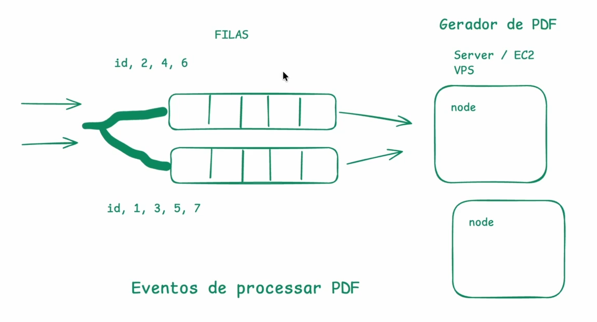
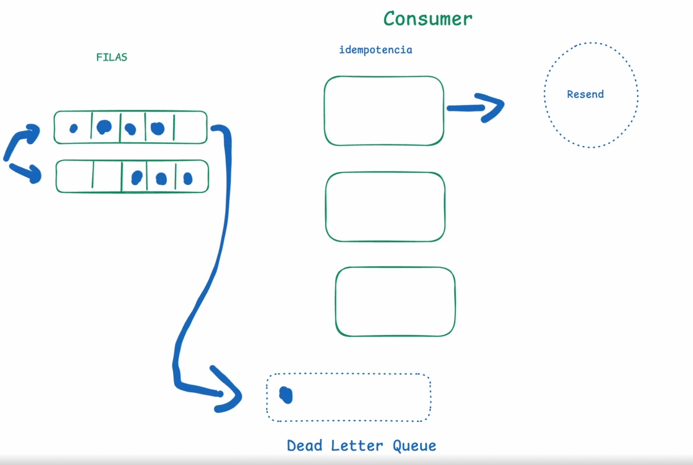

# Message Queue

Uma fila serve para a gente armazenar mensagens que serão processadas posteriormente. Uma Message Queue ou fila de mensagens é uma estrutura de dados que permite a comunicação assíncrona entre processos, normalmente a gente vai ser um servidor que se comunica com uma fila de mensagens. Normalmente elas são:

- Desacopladas, então o servidor não está alocado no mesmo lugar que a fila e não precisa saber quem está consumindo as mensagens
- Tem um produtor e consumidor, o produtor envia as mensagens e o consumidor as processa, normalmente dividos em diferentes servidores, porém podem sim estar no mesmo lugar.
- Pode ser FIFO (First In, First Out), isso depende da necessidade da aplicação.
- Buffer que armazena as mensagens por tempo indeterminado, até que sejam processadas com o objetivo de estabilizar a carga de requisições, então em horários de pico a fila vai ficar mais cheia porque o servidor enviar uma quantidade de mensagens que o consumidor não consegue processar imediatamente, porém em algum momento do dia onde essa carga de requests diminui, a fila vai ficar menos cheia porque o consumidor vai conseguir processar as mensagens, então o buffer vai ficar vazio, ou seja, ele serve para essa estabilização da carga de requisições.
- Fan out ou dispersão - Quando o produtor envia uma mensagem, ela é replicada para todas as filas associadas, permitindo que várias instâncias de consumidores processem a mensagem simultaneamente e fazendo com que caso um processo falhe, a mensagem não seja perdida e possa ser processada por outro consumidor.
- Isolação - Quando uma fila falha, as mensagens não são perdidas e podem ser processadas por outras filas, garantindo a continuidade do serviço.
- Disponibilidade - Quando uma fila falha, as mensagens não são perdidas e podem ser processadas por outras filas, garantindo a continuidade do serviço.
- É assíncrono - As mensagens são processadas de forma assíncrona, ou seja, o produtor não espera que a mensagem seja processada antes de continuar enviando outras mensagens.

---

## Trade-offs

Filas não são para aumentar a performace de um request que meu usuário está fazendo, elas são para garantir a continuidade do serviço mesmo quando ocorrem falhas. Inclusive normalmente filas deixam o processo mais lento, pois o consumidor precisa esperar que a mensagem seja processada antes de continuar. 

Esse é o principal trade-off de filas onde elas não são uma boa caso você precisa de Cônsistencia forte e imetiata e baixa latência. Outro trade-off é a complexidade adicional de gerenciar filas e consumidores e pode deixar o serviço mais lento.

---

## Delivery semantics / Semântica de Entrega

- At-most-once - A mensagem é entregue no máximo uma vez, ou seja, pode ser perdida se o consumidor falhar antes de processar a mensagem. Muito pouco usado.
Exemplo de uso: Streaming de vídeo, onde perder um frame não é um problema.
- At-least-once - A mensagem é entregue pelo menos uma vez, ou seja, não pode ser perdida se o consumidor falhar antes de processar a mensagem. Essa é a semântica padrão de entrega e a mais usada.
Normalmente pelo menos 1x é combinado com idempotência, porque vamos supor o exemplo: E feito um pagamento, se o pagamento falha como e pelo menos uma vez existe uma chance de o pagamento ser duplicado, com idempotência podemos evitar isso por isso esse metodo e o mais usado.
- At-exactly-once - A mensagem é entregue exatamente uma vez, ou seja, não pode ser perdida e não pode ser processada mais de uma vez. Usado em sistemas de transações financeiras e de e-commerce porém com um custo maior de implementação e maior complexidade. 
A garantia de entrega de apenas uma vez e bem complicada de ser implementada, pois requer um controle das duas partes onde pense o cenário: a gente tem um pagamento e o pagamento é enviado para processar e falhou, nesse caso tem que enviar o pagamento novamente ou nao teria que enviar por a compra poder ser duplicada, entao e bem dificil de garantir isso principalmente em sistemas grandes com muitas filas, consumidores, lambdas, etc.

---

## Dead Letter Queue

Uma fila especial que é usada para armazenar mensagens que não puderam ser processadas corretamente, permitindo que elas sejam analisadas e corrigidas posteriormente. A ideia e bem simples, teve um item na fila que falhou e não puder ser processado, então ele é enviado para a DLQ e com isso eu posso fazer o tratamento necessário para corrigir a mensagem.

---

## Queue Partitioning

Vamos supor que a gente tem um sistema gerador de pdfs, esse sistema tem um fila e os pdfs sao processados em server ecs/vps. Conforme uma grande escala eu consigo escalar o servidor de forma facil aumentando a capacidade de processamento da maquina (escala vertical) ou adicionando mais servidores (escala horizontal), porem o gargalo ai seria a fila porque a fila tem um limite de capacidade que ela pode processar. Por isso que surgiu a Queue Partitioning onde eu conseguria ter conforme o exemplo da imagem abaixo duas filas porem para cada fila eu preciso definir uma regra para a mensagem entrar na fila. Um exemplo seria filas com id numero impar vao pra fila 1 enquanto que os id numeros pares vao pra fila 2. Essa particao foi apenas um exemplo, porem conformme a estrutura do objeto poderiam ser usadas outras regras para a particao.

 ---

 ## Consumers ou Consumidores

Normalmente a gente pensa na fila como a fila esta entregando uma mensagem para o consumidor mas na verdade e ao contrario, o consumidor puxa algo da fila como se estivesse fazendo um pull e isso ocorre porque a fila nao necessariamente sabe quando o consumidor acabou de processar a mensagem, quem sabe e o consumidor que faz o processo de:

1. Puxar a mensagem da fila -> 
2. Processar a mensagem -> 
3. Avisar que a mensagem foi processada (Acknowledge) -> 

(nesse momento apos o acknowledge a gente pode ou executar o At-most-once, At-least-once, At-exactly-once ou so remover a mensagem da fila) 

4. Remover a mensagem da fila. 

Sistema como kafka podem ter um offset onde o proprio consumidor pode falar qual foi a ultima mensagem que ele processou e assim o sistema pode saber qual mensagem ele deve puxar da fila.

---

### Escalabilidade de filas - Como escalar?

Para escalar uma fila, a gente pode adicionar mais consumidores ou capacidade/numero de filas, assim o sistema pode processar mais mensagens em paralelo, entao as estrategrias pricipais sao:

1. Particionamento de filas
2. Mais filas
3. Mais consumidores
4. Processar em batch - Processar varias mensagens de uma vez, entao ao inves de processar 1 item da fila, o sistema pode processar 10 de uma vez
5. Autoscaling - Escala automatica em picos de trafego
6. Fila de alta prioridade e baixa prioridade - Prioridade de mensagens conforme a regra de negocios, onde essas mensagens de baixa prioridade sao procesadas quando o sitema esta menos ocupado (normalmente de madrugada por exemplo).

---

## Problemas com escalabilidade de filas

1. Pode ocorrer de uma fila ficar cheia e a outra vazia, ou seja, a gente precisaria de uma estrategia pra balancear o numero de mensagens entre as filas.
2. Aumenta a complexidade para debugar caso uma mensagem falhe trabalhando com mais de uma fila.

---

## DQL e Retries

Vamos supor que a gente tem uma fila, o consumer processou a mensagem e precisou enviar um e-mail para o cliente porem a API do e-mail falhou e a mensagem nao foi enviada. O que fazer?

Isso poderia ter um retry automático, onde o sistema tenta enviar a mensagem novamente em um intervalo de tempo, até que a API do e-mail funcione novamente ou o numero de tentativas seja atingido. Isso vai depender da regra de negocios, de como foi implementado e do numero de tentativas permitidas. Uma coisa a se destacar e que para permitir que tenhamos esse retry e necessario ter uma chave de idepotencia para garantir que a mensagem nao seja duplicada.

Caso a mensagem falhe e o numero de tentativas seja atingido, a mensagem pode ser enviada para uma fila de dead letter e jogar essas mensagens para um sistema de monitoramento, ou um banco de dados especializado para armazenar essas mensagens como DynamoDB, MongoDB, etc. Outra forma seria triggar no processo enviando um e-mail pro usuario falando que o processamento falhou.