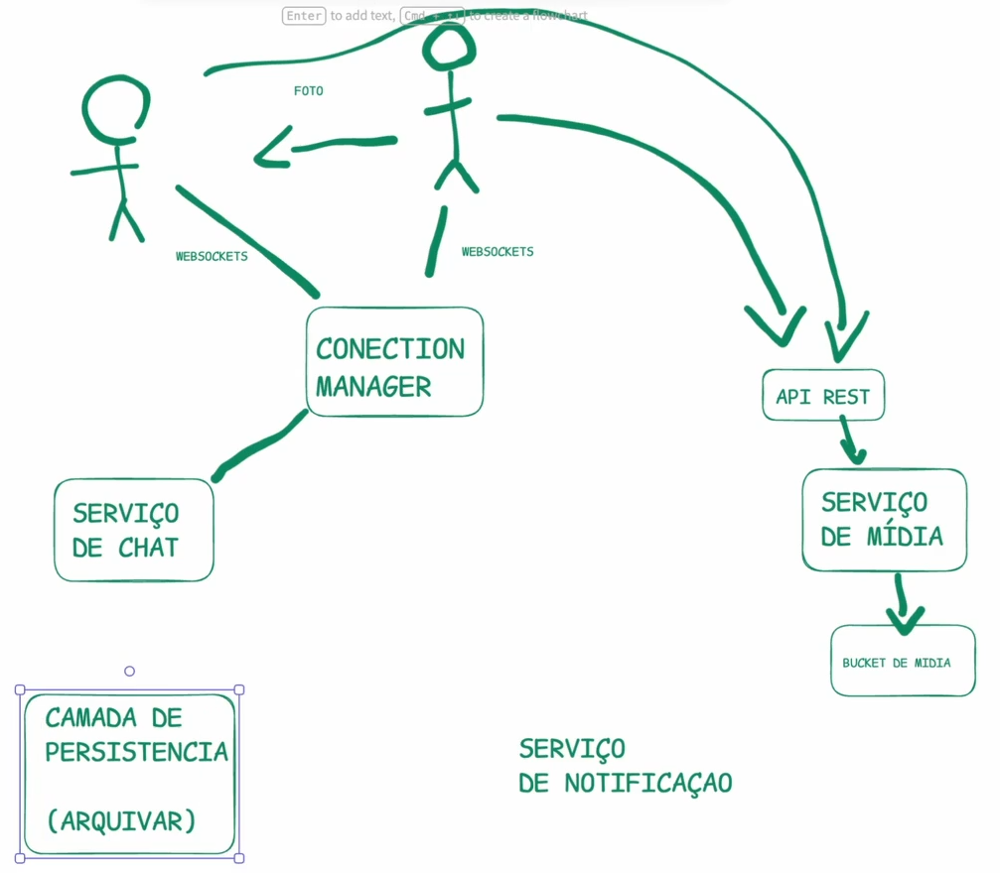
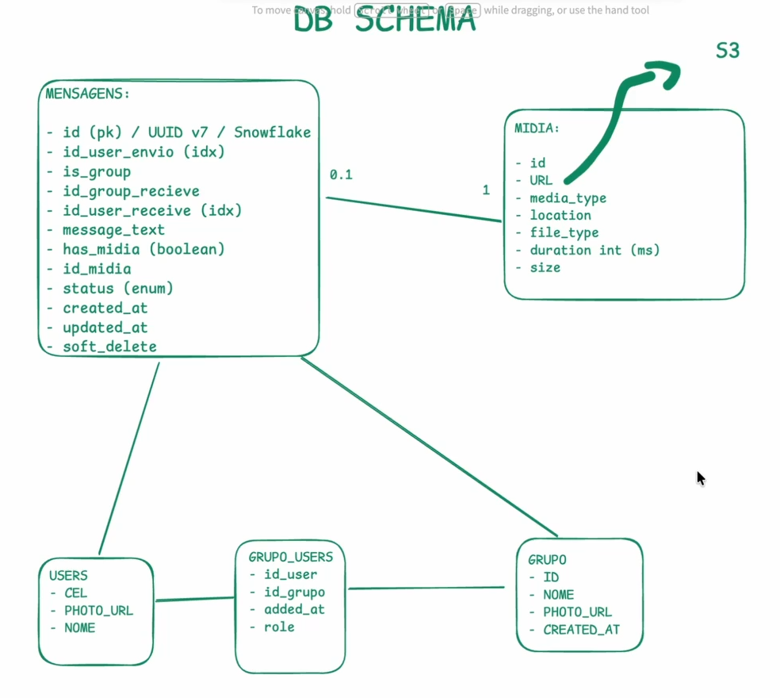
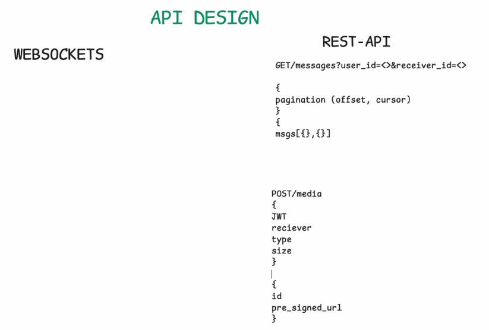
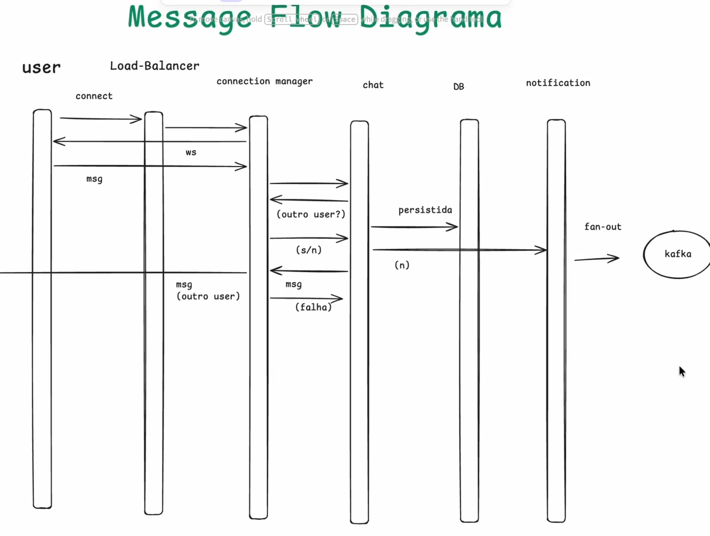
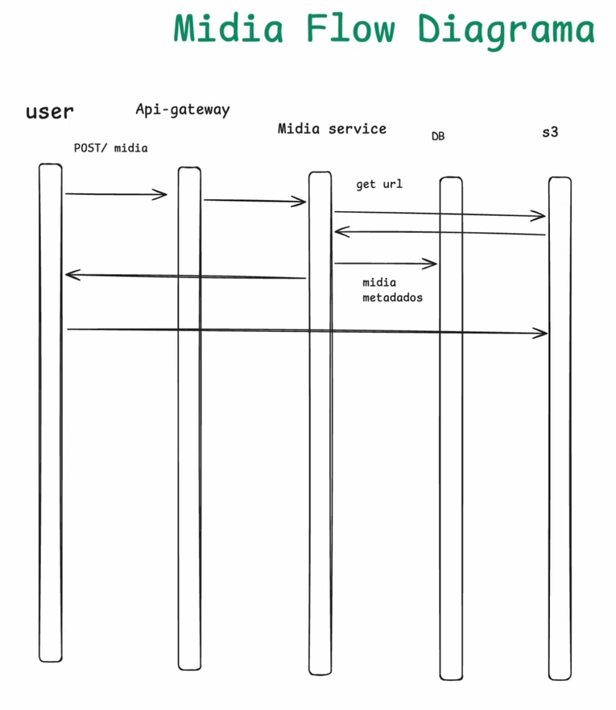
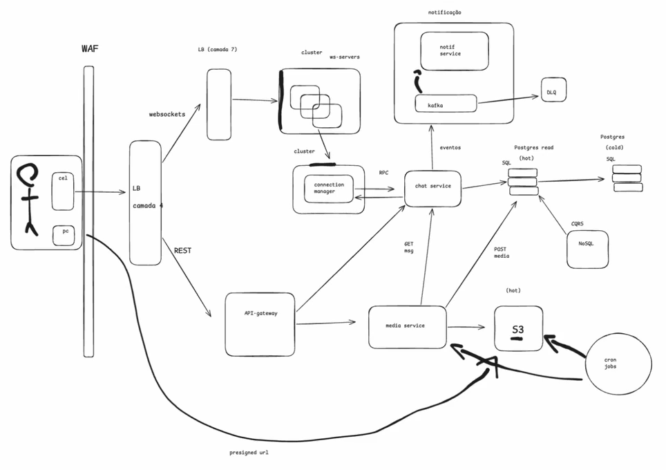

**1 - Requisitos Funcionais**

* Mensagens 1:1 e em grupo
* Realtime (ou quase)
* Status? (online, digitando)
* Áudios, fotos, vídeo
* Compressão?
* HD / Comprimida
* Downloads em background
* Read receipt?
* Multi device support?
* Busca?
* Dentro do celular
* No servidor

---

**2 - Requisitos Não Funcionais**

* Entrega de mensagens com delay de 1s
* Alta disponibilidade
* E2E encription (Criptografia de ponta a ponta)
* Milhões de usuários
* Usabilidade boa mesmo com pouca internet

---

**3 - Pontos de Atenção**

* Ordem das mensagens (e entrega)
* Baixa internet? (retries, idempotência)
* Escala
* Sync
* Entrega p/ grupos
* Fan out
* Armazenamento de fotos (1 semana)
* Backup dos chats
* Websockets
* Conexões persistentes p/ milhões de users

---

**4 - Estimativas (BoE)**

* 100M / dia
* 20 * 200M -> 4Bi de msg (37Tb)
* 10M users concorrentes
* 1mb * 1 * 100m -> 95Tb por dia

**5 - Overview de Alto Nível**

---

**6 - Schema DB**

---

**7 - Design da API**

---

**8 - Flow**

API Flow

Media Flow

---

**9 - SD Completo**

