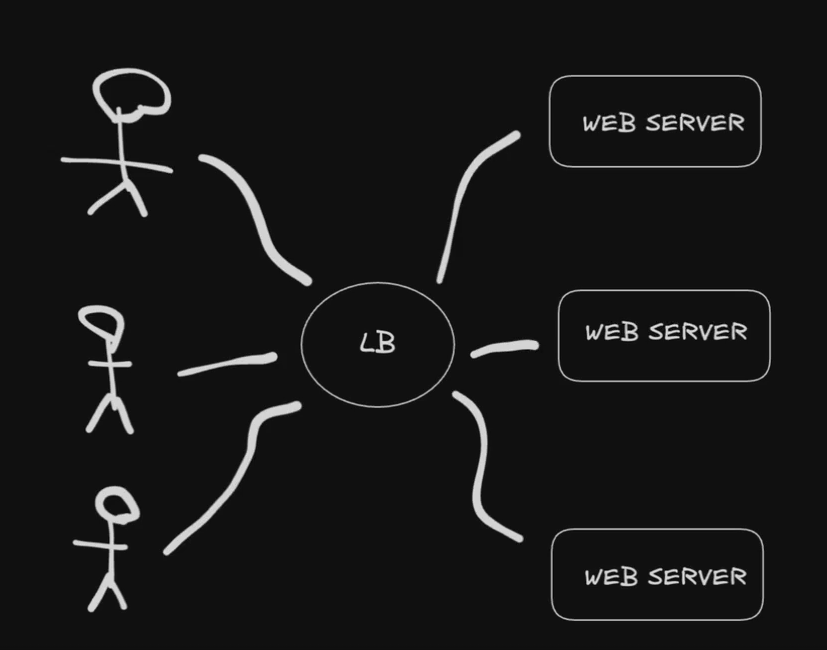
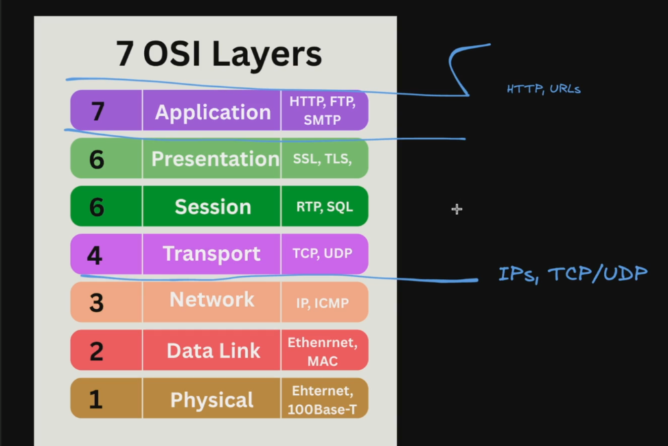

# Load Balancer

O propósito do Load Balancer é distribuir o tráfego de entrada entre vários servidores ou instâncias de um serviço. Entao quando um usuario acessa meu site, o Load Balancer direciona o tráfego para um dos servidores disponíveis.

### Pra que serve o Load Balancer?

1. Distribuir carga - Distribuir o tráfego de entrada entre vários servidores ou instâncias de um serviço.
2. Escalabidade - Adicionar ou remover servidores automaticamente para atender à demanda.
3. DDos - Proteger contra ataques de negação de serviço (DDoS).]

Em aplicações reais, a gente pode ter um Load Balancer que se comunica entre cliente e o front-end da nossa aplicação, mas a gente pode ter um outro load balancer que se comunica entre o front-end e os servidores de back-end, podendo ter o back-end armazenados em multiplas instancias e tambem pode ocorrer de precisar ter um load balancer entre o backend e o banco de dados para distribuir a carga de leitura e escrita, ou seja, load balancer entre todos os niveis da aplicação.

---

### Funcionalidades do Load Balancer:

1. Health Check - Verificar a saúde dos servidores ou instâncias de um serviço, entao se uma instancia cair, o Load Balancer automaticamente redireciona o tráfego para outra instancia saudável. Outro caso seria com aumento de tráfego, o Load Balancer pode redirecionar o tráfego para instancias com menos carga, para evitar sobrecarga.
2. Provionamento Dinâmico - O Load Balancer pode provionar dinamicamente novas instâncias de servidores ou instâncias de um serviço, dependendo da demanda e da disponibilidade de recursos.
3. TLS Termination - O Load Balancer pode terminar o TLS (Transport Layer Security) para criptografar o tráfego entre o cliente e o servidor, garantindo a segurança dos dados.
4. Segurança - O Load Balancer pode fornecer segurança adicional, como autenticação, autorização e criptografia, para proteger o tráfego entre o cliente e o servidor.

---

### Como o Load Balancer funciona distribuindo a carga?

Agora que entendemos as funcionalidades do Load Balancer, vamos entender como ele funciona distribuindo a carga:

1. Round Robin - O Load Balancer distribui a carga entre os servidores ou instâncias de um serviço usando o algoritmo Round Robin, onde cada solicitação é atribuída ao próximo servidor na fila.
2. Weighted Round Robin - O Load Balancer pode usar o algoritmo Weighted Round Robin, onde cada servidor ou instância de um serviço é atribuído um peso, e o tráfego é distribuído com base nos pesos. Isso e recomendado quando os servidores ou instâncias de um serviço possuem capacidades diferentes, entao se eu tenho um servidor mais parrudo que outro, ele deve receber mais tráfego.
3. Least Connections - O Load Balancer pode usar o algoritmo Least Connections, onde o servidor ou instância de um serviço com menos conexões ativas recebe mais tráfego.
4. Least Response Time - O Load Balancer pode usar o algoritmo Least Response Time, onde o servidor ou instância de um serviço com menor tempo de resposta recebe mais tráfego.
5. Ip Hash - O Load Balancer pode usar o algoritmo Ip Hash, onde o servidor ou instância de um serviço é atribuído com base no endereço IP do cliente, garantindo que o mesmo cliente sempre seja direcionado para o mesmo servidor.

### Estático vs Dinâmico

O Load Balancer pode ser configurado como estático ou dinâmico, dependendo da necessidade. 

Um Load Balancer estático tem:
1. Regras Fixas - As regras do Load Balancer são configuradas com um conjunto fixo de servidores ou instâncias de um serviço, e não podem ser alteradas dinamicamente.
2. Não conhece o estado do servidor - O Load Balancer estático não conhece o estado do servidor, ou seja, ele não sabe se o servidor está ativo ou inativo, e sempre direciona o tráfego para um servidor ou instância de um serviço configurado.

Um Load Balancer dinâmico tem:
1. Monitoramento dos servidores - O Load Balancer dinâmico monitora o estado dos servidores, ou seja, ele sabe se o servidor está ativo ou inativo, e direciona o tráfego para o servidor mais adequado.

### Stateful vs Stateless

Um Load Balancer stateful mantém o estado do cliente, enquanto um Load Balancer stateless não mantém o estado do cliente. 

---

### Camada OSI

O Load Balancer funciona na camada de transporte ou na camada de aplicação do modelo OSI. Na camada de transporte, ele direciona o tráfego entre os servidores e os clientes, enquanto na camada de aplicação, ele pode usar protocolos como HTTP ou HTTPS para direcionar o tráfego. Já na camada de aplicação, o Load Balancer pode usar protocolos como HTTP ou HTTPS para direcionar o tráfego.

